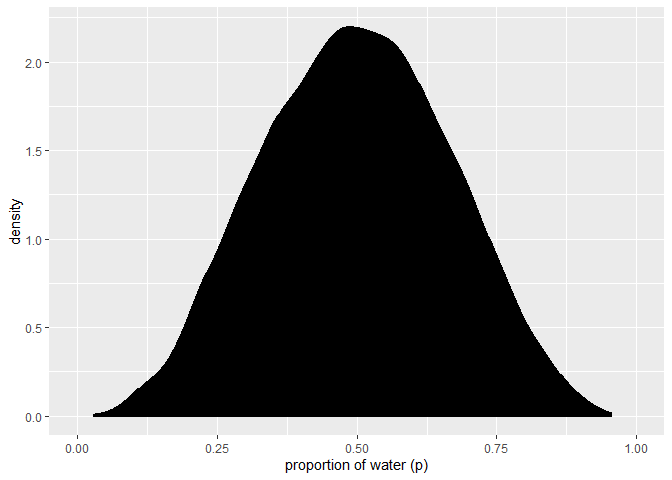
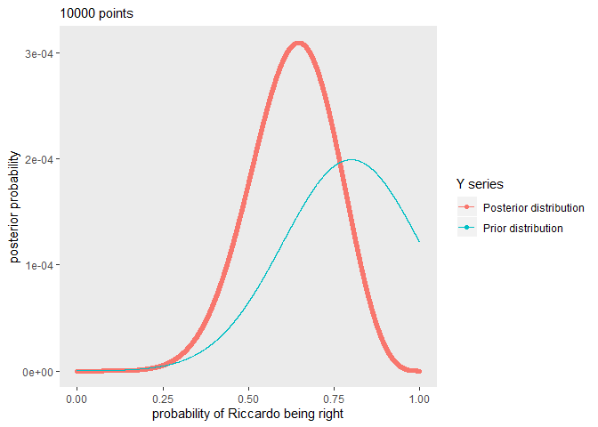
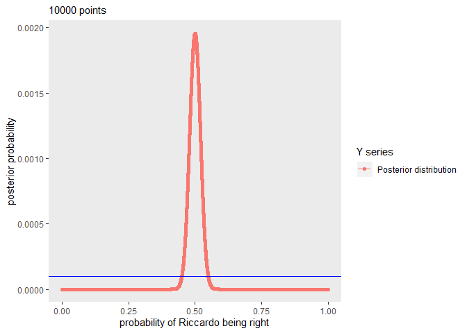
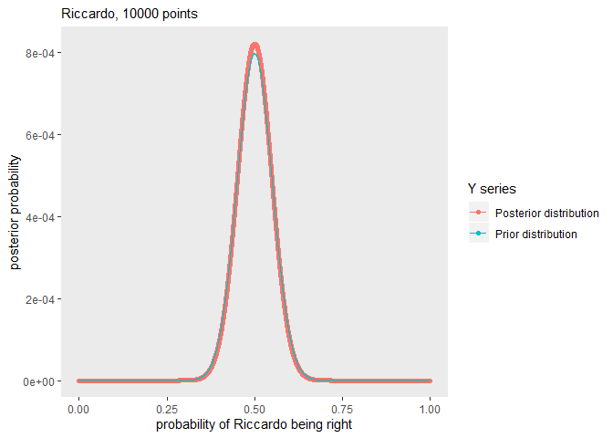
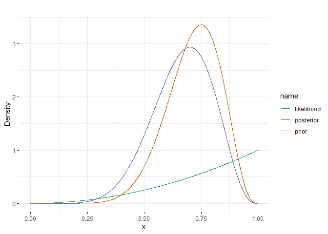
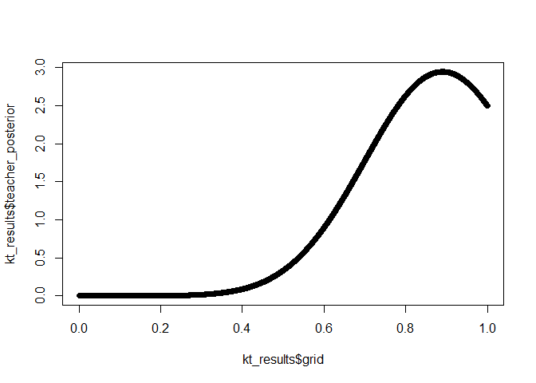
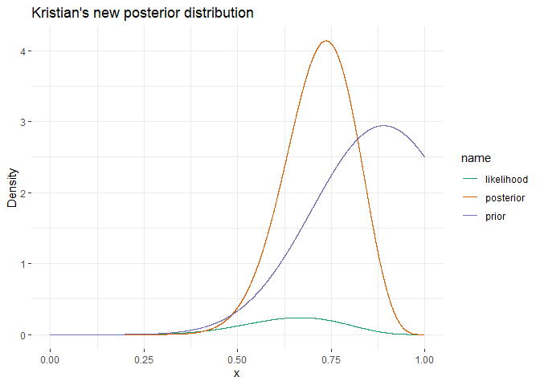
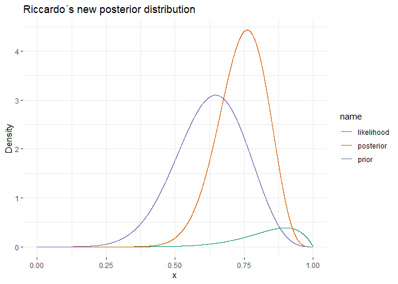

Libraries
---------

In this assignment we learn how to assess rates from a binomial distribution, using the case of assessing your teachers’ knowledge of CogSci
--------------------------------------------------------------------------------------------------------------------------------------------

N.B. there is a second part at the bottom for next week.

### First part

You want to assess your teachers’ knowledge of cognitive science. “These
guys are a bunch of drama(turgist) queens, mindless philosophers,
chattering communication people and Russian spies. Do they really know
CogSci?”, you think.

To keep things simple (your teachers should not be faced with too
complicated things): - You created a pool of equally challenging
questions on CogSci - Each question can be answered correctly or not (we
don’t allow partially correct answers, to make our life simpler). -
Knowledge of CogSci can be measured on a scale from 0 (negative
knowledge, all answers wrong) through 0.5 (random chance) to 1 (awesome
CogSci superpowers)

This is the data: - Riccardo: 3 correct answers out of 6 questions -
Kristian: 2 correct answers out of 2 questions (then he gets bored) -
Josh: 160 correct answers out of 198 questions (Josh never gets bored) -
Mikkel: 66 correct answers out of 132 questions

Questions:

1.  What’s Riccardo’s estimated knowledge of CogSci? What is the
    probability he knows more than chance (0.5) \[try figuring this out.
    if you can’t peek into chapters 3.1 and 3.2 and/or the slides\]?

-   First implement a grid approximation (hint check paragraph 2.4.1!)
    with a uniform prior, calculate the posterior and plot the results
-   Then implement a quadratic approximation (hint check paragraph
    2.4.2!).
-   N.B. for the rest of the exercise just keep using the grid
    approximation (we’ll move to quadratic approximations in two
    classes)

``` r
# We do grid approximation

(r <-
 tibble(p_grid            = seq(from = 0, to = 1, length.out = 20),  # define grid
        prior             = 1) %>%                                   # define prior
   mutate(likelihood      = dbinom(3, size = 6, prob = p_grid)) %>%  # compute likelihood at each value in grid
   mutate(unstd_posterior = likelihood * prior) %>%                  # compute product of likelihood and prior
   mutate(posterior       = unstd_posterior / sum(unstd_posterior))  # standardize the posterior, so it sums to 1
)
```

    ## # A tibble: 20 x 5
    ##    p_grid prior likelihood unstd_posterior posterior
    ##     <dbl> <dbl>      <dbl>           <dbl>     <dbl>
    ##  1 0          1    0               0        0       
    ##  2 0.0526     1    0.00248         0.00248  0.000913
    ##  3 0.105      1    0.0167          0.0167   0.00616 
    ##  4 0.158      1    0.0470          0.0470   0.0173  
    ##  5 0.211      1    0.0918          0.0918   0.0338  
    ##  6 0.263      1    0.146           0.146    0.0537  
    ##  7 0.316      1    0.202           0.202    0.0743  
    ##  8 0.368      1    0.252           0.252    0.0928  
    ##  9 0.421      1    0.290           0.290    0.107   
    ## 10 0.474      1    0.310           0.310    0.114   
    ## 11 0.526      1    0.310           0.310    0.114   
    ## 12 0.579      1    0.290           0.290    0.107   
    ## 13 0.632      1    0.252           0.252    0.0928  
    ## 14 0.684      1    0.202           0.202    0.0743  
    ## 15 0.737      1    0.146           0.146    0.0537  
    ## 16 0.789      1    0.0918          0.0918   0.0338  
    ## 17 0.842      1    0.0470          0.0470   0.0173  
    ## 18 0.895      1    0.0167          0.0167   0.00616 
    ## 19 0.947      1    0.00248         0.00248  0.000913
    ## 20 1          1    0               0        0

``` r
## We plot it
r_1 <- r %>% 
  ggplot(aes(x = p_grid, y = posterior, color = "red")) +
  geom_point() +
  geom_line() +
  labs(subtitle = "20 points",
       x = "probability of Riccardo being right",
       y = "posterior probability") +
  theme(panel.grid = element_blank()) + geom_hline(yintercept=1/20, color = "blue") +
  scale_color_discrete(name = "Y series", labels = c("Posterior distribution", "Prior distribution"))
## Prior divided by the 20 grids for scaling
r_1
```


``` r
## We do quadritic approximation
Riccardo_qa <-
  rethinking::map(
    alist(
      w ~ dbinom(6, p),  # binomial likelihood
      p ~ dunif(0, 1)    # uniform prior
    ), 
    data = list(w = 3))

# display summary of quadratic approximation
precis(Riccardo_qa)
```

    ##   Mean StdDev 5.5% 94.5%
    ## p  0.5    0.2 0.17  0.83

``` r
# We sample from the Grid approximation
set.seed(3)
samples <-
  r %>% 
  sample_n(size = 1e4, weight = posterior, replace = T)

# We make a density plot of the sample
samples %>% 
  ggplot(aes(x = p_grid)) +
  geom_density(fill = "black") +
  coord_cartesian(xlim = 0:1) +
  xlab("proportion of water (p)")
```



``` r
#We want to know how likely Riccardo is to perform above chance
r %>% 
  filter(p_grid > .5) %>% 
  summarise(sum = sum(posterior))
```

    ## # A tibble: 1 x 1
    ##     sum
    ##   <dbl>
    ## 1   0.5

This means that there is 50% chance that Riccardo will perform better
than chance.

1.  Estimate all the teachers’ knowledge of CogSci. Who’s best? Use grid
    approximation. Comment on the posteriors of Riccardo and Mikkel. 2a.
    Produce plots of the prior, and posterior for each teacher.

``` r
################# We do grid approximation for Kristian ################
(k <-
 tibble(p_grid            = seq(from = 0, to = 1, length.out = 20),  # define grid
        prior             = 1) %>%                                   # define prior
   mutate(likelihood      = dbinom(2, size = 2, prob = p_grid)) %>%  # compute likelihood at each value in grid
   mutate(unstd_posterior = likelihood * prior) %>%                  # compute product of likelihood and prior
   mutate(posterior       = unstd_posterior / sum(unstd_posterior))  # standardize the posterior, so it sums to 1
)
```

    ## # A tibble: 20 x 5
    ##    p_grid prior likelihood unstd_posterior posterior
    ##     <dbl> <dbl>      <dbl>           <dbl>     <dbl>
    ##  1 0          1    0               0        0       
    ##  2 0.0526     1    0.00277         0.00277  0.000405
    ##  3 0.105      1    0.0111          0.0111   0.00162 
    ##  4 0.158      1    0.0249          0.0249   0.00364 
    ##  5 0.211      1    0.0443          0.0443   0.00648 
    ##  6 0.263      1    0.0693          0.0693   0.0101  
    ##  7 0.316      1    0.0997          0.0997   0.0146  
    ##  8 0.368      1    0.136           0.136    0.0198  
    ##  9 0.421      1    0.177           0.177    0.0259  
    ## 10 0.474      1    0.224           0.224    0.0328  
    ## 11 0.526      1    0.277           0.277    0.0405  
    ## 12 0.579      1    0.335           0.335    0.0490  
    ## 13 0.632      1    0.399           0.399    0.0583  
    ## 14 0.684      1    0.468           0.468    0.0684  
    ## 15 0.737      1    0.543           0.543    0.0794  
    ## 16 0.789      1    0.623           0.623    0.0911  
    ## 17 0.842      1    0.709           0.709    0.104   
    ## 18 0.895      1    0.801           0.801    0.117   
    ## 19 0.947      1    0.898           0.898    0.131   
    ## 20 1          1    1               1        0.146

``` r
## We plot
k %>% 
  ggplot(aes(x = p_grid, y = posterior, color = "red")) +
  geom_point() +
  geom_line() +
  labs(subtitle = "20 points",
       x = "probability of Kristian being right",
       y = "posterior probability") +
  theme(panel.grid = element_blank()) + geom_hline(yintercept=1/20) + 
  scale_color_discrete(name = "Y series", labels = c("Posterior distribution", "Prior distribution"))
```


``` r
  ## Prior divided by the 20 grids for scaling 


# We sample from the Grid approximation
set.seed(3)
samples <-
  k %>% 
  sample_n(size = 1e4, weight = posterior, replace = T)

# We make a density plot of the sample
samples %>% 
  ggplot(aes(x = p_grid)) +
  geom_density(fill = "black") +
  coord_cartesian(xlim = 0:1) +
  xlab("proportion of correct answers")
```


``` r
#We want to know how likely Riccardo is to perform above chance
k %>% 
  filter(p_grid > .5) %>% 
  summarise(sum = sum(posterior))
```

    ## # A tibble: 1 x 1
    ##     sum
    ##   <dbl>
    ## 1 0.885

``` r
## We do a prior predictive check
ppc <- rbinom(1e4, 6, runif(1e4, min = 0.5, max = 1))
dens(ppc)
```


``` r
################# We do a grid approximation for Josh ################
# We do grid approximation

(j <-
 tibble(p_grid            = seq(from = 0, to = 1, length.out = 20),  # define grid
        prior             = 1) %>%                                   # define prior
   mutate(likelihood      = dbinom(160, size = 198, prob = p_grid)) %>%  # compute likelihood at each value in grid
   mutate(unstd_posterior = likelihood * prior) %>%                  # compute product of likelihood and prior
   mutate(posterior       = unstd_posterior / sum(unstd_posterior))  # standardize the posterior, so it sums to 1
)
```

    ## # A tibble: 20 x 5
    ##    p_grid prior likelihood unstd_posterior posterior
    ##     <dbl> <dbl>      <dbl>           <dbl>     <dbl>
    ##  1 0          1  0.              0.        0.       
    ##  2 0.0526     1  2.58e-165       2.58e-165 2.73e-164
    ##  3 0.105      1  4.30e-118       4.30e-118 4.55e-117
    ##  4 0.158      1  6.42e- 91       6.42e- 91 6.79e- 90
    ##  5 0.211      1  5.41e- 72       5.41e- 72 5.72e- 71
    ##  6 0.263      1  1.26e- 57       1.26e- 57 1.33e- 56
    ##  7 0.316      1  3.51e- 46       3.51e- 46 3.72e- 45
    ##  8 0.368      1  8.64e- 37       8.64e- 37 9.14e- 36
    ##  9 0.421      1  6.01e- 29       6.01e- 29 6.36e- 28
    ## 10 0.474      1  2.46e- 22       2.46e- 22 2.60e- 21
    ## 11 0.526      1  9.40e- 17       9.40e- 17 9.94e- 16
    ## 12 0.579      1  4.49e- 12       4.49e- 12 4.75e- 11
    ## 13 0.632      1  3.12e-  8       3.12e-  8 3.30e-  7
    ## 14 0.684      1  3.25e-  5       3.25e-  5 3.44e-  4
    ## 15 0.737      1  4.50e-  3       4.50e-  3 4.76e-  2
    ## 16 0.789      1  5.82e-  2       5.82e-  2 6.15e-  1
    ## 17 0.842      1  3.17e-  2       3.17e-  2 3.36e-  1
    ## 18 0.895      1  1.05e-  4       1.05e-  4 1.11e-  3
    ## 19 0.947      1  3.59e- 12       3.59e- 12 3.80e- 11
    ## 20 1          1  0.              0.        0.

``` r
## We plot it
j %>% 
  ggplot(aes(x = p_grid, y = posterior, color = "red")) +
  geom_point() +
  geom_line() +
  labs(subtitle = "20 points",
       x = "probability of Josh being right",
       y = "posterior probability") +
  theme(panel.grid = element_blank()) + geom_hline(yintercept=1/20) +
  scale_color_discrete(name = "Y series", labels = c("Posterior distribution", "Prior distribution"))
```


``` r
# We sample from the Grid approximation
set.seed(3)
samples <-
  j %>% 
  sample_n(size = 1e4, weight = posterior, replace = T)

# We make a density plot of the sample
samples %>% 
  ggplot(aes(x = p_grid)) +
  geom_density(fill = "black") +
  coord_cartesian(xlim = 0:1) +
  xlab("proportion of correct answers")
```


``` r
#We want to know how likely Riccardo is to perform above chance
j %>% 
  filter(p_grid > .5) %>% 
  summarise(sum = sum(posterior))
```

    ## # A tibble: 1 x 1
    ##     sum
    ##   <dbl>
    ## 1     1

``` r
################ We do grid approximation for Mikkel ################
# We do grid approximation

(m <-
 tibble(p_grid            = seq(from = 0, to = 1, length.out = 20),  # define grid
        prior             = 1) %>%                                   # define prior
   mutate(likelihood      = dbinom(66, size = 132, prob = p_grid)) %>%  # compute likelihood at each value in grid
   mutate(unstd_posterior = likelihood * prior) %>%                  # compute product of likelihood and prior
   mutate(posterior       = unstd_posterior / sum(unstd_posterior))  # standardize the posterior, so it sums to 1
)
```

    ## # A tibble: 20 x 5
    ##    p_grid prior likelihood unstd_posterior posterior
    ##     <dbl> <dbl>      <dbl>           <dbl>     <dbl>
    ##  1 0          1   0.              0.        0.      
    ##  2 0.0526     1   4.26e-48        4.26e-48  2.98e-47
    ##  3 0.105      1   7.23e-30        7.23e-30  5.06e-29
    ##  4 0.158      1   5.54e-20        5.54e-20  3.88e-19
    ##  5 0.211      1   1.38e-13        1.38e-13  9.65e-13
    ##  6 0.263      1   3.61e- 9        3.61e- 9  2.53e- 8
    ##  7 0.316      1   4.57e- 6        4.57e- 6  3.20e- 5
    ##  8 0.368      1   6.08e- 4        6.08e- 4  4.25e- 3
    ##  9 0.421      1   1.31e- 2        1.31e- 2  9.17e- 2
    ## 10 0.474      1   5.77e- 2        5.77e- 2  4.04e- 1
    ## 11 0.526      1   5.77e- 2        5.77e- 2  4.04e- 1
    ## 12 0.579      1   1.31e- 2        1.31e- 2  9.17e- 2
    ## 13 0.632      1   6.08e- 4        6.08e- 4  4.25e- 3
    ## 14 0.684      1   4.57e- 6        4.57e- 6  3.20e- 5
    ## 15 0.737      1   3.61e- 9        3.61e- 9  2.53e- 8
    ## 16 0.789      1   1.38e-13        1.38e-13  9.65e-13
    ## 17 0.842      1   5.54e-20        5.54e-20  3.88e-19
    ## 18 0.895      1   7.23e-30        7.23e-30  5.06e-29
    ## 19 0.947      1   4.26e-48        4.26e-48  2.98e-47
    ## 20 1          1   0.              0.        0.

``` r
## We plot it
m %>% 
  ggplot(aes(x = p_grid, y = posterior, color = "red")) +
  geom_point() +
  geom_line() +
  labs(subtitle = "20 points",
       x = "probability of Mikkel being right",
       y = "posterior probability") +
  theme(panel.grid = element_blank())  + geom_hline(yintercept=1/20) +
  scale_color_discrete(name = "Y series", labels = c("Posterior distribution", "Prior distribution"))
```


``` r
# We sample from the Grid approximation
set.seed(3)
samples <-
  m %>% 
  sample_n(size = 1e4, weight = posterior, replace = T)

# We make a density plot of the sample
samples %>% 
  ggplot(aes(x = p_grid)) +
  geom_density(fill = "black") +
  coord_cartesian(xlim = 0:1) +
  xlab("proportion of correct answers")
```


``` r
#We want to know how likely Mikkel is to perform above chance
m %>% 
  filter(p_grid > .5) %>% 
  summarise(sum = sum(posterior))
```

    ## # A tibble: 1 x 1
    ##     sum
    ##   <dbl>
    ## 1   0.5

Josh is the best. Riccard and Mikkel both have a 50 % chance of
performing above chance.

1.  Change the prior. Given your teachers have all CogSci jobs, you
    should start with a higher appreciation of their knowledge: the
    prior is a normal distribution with a mean of 0.8 and a standard
    deviation of 0.2. 3a. Produce plots of the prior and posterior for
    each teacher.

``` r
### Riccardo
# We make the new posterior from a new prior
(r <-
 tibble(p_grid            = seq(from = 0, to = 1, length.out = 20),  # define grid
        prior             = dnorm(p_grid, mean = 0.8, sd = 0.2)) %>%                                   # define prior
   mutate(likelihood      = dbinom(3, size = 6, prob = p_grid)) %>%  # compute likelihood at each value in grid
   mutate(unstd_posterior = likelihood * prior) %>%                  # compute product of likelihood and prior
   mutate(posterior       = unstd_posterior / sum(unstd_posterior))  # standardize the posterior, so it sums to 1
)
```

    ## # A tibble: 20 x 5
    ##    p_grid    prior likelihood unstd_posterior  posterior
    ##     <dbl>    <dbl>      <dbl>           <dbl>      <dbl>
    ##  1 0      0.000669    0            0          0         
    ##  2 0.0526 0.00185     0.00248      0.00000459 0.00000211
    ##  3 0.105  0.00478     0.0167       0.0000799  0.0000367 
    ##  4 0.158  0.0115      0.0470       0.000542   0.000249  
    ##  5 0.211  0.0259      0.0918       0.00238    0.00109   
    ##  6 0.263  0.0544      0.146        0.00793    0.00365   
    ##  7 0.316  0.106       0.202        0.0215     0.00987   
    ##  8 0.368  0.194       0.252        0.0490     0.0225    
    ##  9 0.421  0.331       0.290        0.0960     0.0441    
    ## 10 0.474  0.527       0.310        0.163      0.0751    
    ## 11 0.526  0.782       0.310        0.242      0.111     
    ## 12 0.579  1.08        0.290        0.314      0.144     
    ## 13 0.632  1.40        0.252        0.353      0.162     
    ## 14 0.684  1.69        0.202        0.340      0.156     
    ## 15 0.737  1.90        0.146        0.277      0.127     
    ## 16 0.789  1.99        0.0918       0.183      0.0841    
    ## 17 0.842  1.95        0.0470       0.0917     0.0422    
    ## 18 0.895  1.78        0.0167       0.0298     0.0137    
    ## 19 0.947  1.52        0.00248      0.00377    0.00173   
    ## 20 1      1.21        0            0          0

``` r
## We plot
r %>% 
  ggplot(aes(x = p_grid, y = posterior, colour="blue")) +
  geom_point() +
  geom_line() +
  labs(subtitle = "20 points",
       x = "probability of Riccardo being right",
       y = "posterior probability") +
  theme(panel.grid = element_blank()) + geom_line(aes(p_grid, (dnorm(p_grid, mean = 0.8, sd = 0.2)/20), colour="red")) +
  scale_color_discrete(name = "Y series", labels = c("Posterior distribution", "Prior distribution"))
```



``` r
## Prior divided by the 20 grids for scaling
#The previous plot was
r_1
```


``` r
### Kristian
# We make the new posterior from a new prior
(k <-
 tibble(p_grid            = seq(from = 0, to = 1, length.out = 20),  # define grid
        prior             = dnorm(p_grid, mean = 0.8, sd = 0.2)) %>%                                   # define prior
   mutate(likelihood      = dbinom(2, size = 2, prob = p_grid)) %>%  # compute likelihood at each value in grid
   mutate(unstd_posterior = likelihood * prior) %>%                  # compute product of likelihood and prior
   mutate(posterior       = unstd_posterior / sum(unstd_posterior))  # standardize the posterior, so it sums to 1
)
```

    ## # A tibble: 20 x 5
    ##    p_grid    prior likelihood unstd_posterior   posterior
    ##     <dbl>    <dbl>      <dbl>           <dbl>       <dbl>
    ##  1 0      0.000669    0            0          0          
    ##  2 0.0526 0.00185     0.00277      0.00000513 0.000000523
    ##  3 0.105  0.00478     0.0111       0.0000530  0.00000541 
    ##  4 0.158  0.0115      0.0249       0.000287   0.0000293  
    ##  5 0.211  0.0259      0.0443       0.00115    0.000117   
    ##  6 0.263  0.0544      0.0693       0.00377    0.000384   
    ##  7 0.316  0.106       0.0997       0.0106     0.00108    
    ##  8 0.368  0.194       0.136        0.0264     0.00269    
    ##  9 0.421  0.331       0.177        0.0587     0.00599    
    ## 10 0.474  0.527       0.224        0.118      0.0121     
    ## 11 0.526  0.782       0.277        0.217      0.0221     
    ## 12 0.579  1.08        0.335        0.363      0.0370     
    ## 13 0.632  1.40        0.399        0.558      0.0569     
    ## 14 0.684  1.69        0.468        0.790      0.0806     
    ## 15 0.737  1.90        0.543        1.03       0.105      
    ## 16 0.789  1.99        0.623        1.24       0.127      
    ## 17 0.842  1.95        0.709        1.38       0.141      
    ## 18 0.895  1.78        0.801        1.43       0.146      
    ## 19 0.947  1.52        0.898        1.36       0.139      
    ## 20 1      1.21        1            1.21       0.123

``` r
## We plot
k %>% 
  ggplot(aes(x = p_grid, y = posterior, colour="blue")) +
  geom_point() +
  geom_line() +
  labs(subtitle = "20 points",
       x = "probability of Kristian being right",
       y = "posterior probability") +
  theme(panel.grid = element_blank()) + geom_line(aes(p_grid, (dnorm(p_grid, mean = 0.8, sd = 0.2)/20), colour="red")) +
  scale_color_discrete(name = "Y series", labels = c("Posterior distribution", "Prior distribution"))
```


``` r
## Prior divided by the 20 grids for scaling

#### Josh
# We make the new posterior from a new prior
(j <-
 tibble(p_grid            = seq(from = 0, to = 1, length.out = 20),  # define grid
        prior             = dnorm(p_grid, mean = 0.8, sd = 0.2)) %>%                                   # define prior
   mutate(likelihood      = dbinom(160, size = 198, prob = p_grid)) %>%  # compute likelihood at each value in grid
   mutate(unstd_posterior = likelihood * prior) %>%                  # compute product of likelihood and prior
   mutate(posterior       = unstd_posterior / sum(unstd_posterior))  # standardize the posterior, so it sums to 1
)
```

    ## # A tibble: 20 x 5
    ##    p_grid    prior likelihood unstd_posterior posterior
    ##     <dbl>    <dbl>      <dbl>           <dbl>     <dbl>
    ##  1 0      0.000669  0.              0.        0.       
    ##  2 0.0526 0.00185   2.58e-165       4.78e-168 2.56e-167
    ##  3 0.105  0.00478   4.30e-118       2.06e-120 1.10e-119
    ##  4 0.158  0.0115    6.42e- 91       7.40e- 93 3.97e- 92
    ##  5 0.211  0.0259    5.41e- 72       1.40e- 73 7.51e- 73
    ##  6 0.263  0.0544    1.26e- 57       6.84e- 59 3.67e- 58
    ##  7 0.316  0.106     3.51e- 46       3.74e- 47 2.00e- 46
    ##  8 0.368  0.194     8.64e- 37       1.68e- 37 9.00e- 37
    ##  9 0.421  0.331     6.01e- 29       1.99e- 29 1.07e- 28
    ## 10 0.474  0.527     2.46e- 22       1.30e- 22 6.94e- 22
    ## 11 0.526  0.782     9.40e- 17       7.35e- 17 3.94e- 16
    ## 12 0.579  1.08      4.49e- 12       4.86e- 12 2.61e- 11
    ## 13 0.632  1.40      3.12e-  8       4.37e-  8 2.34e-  7
    ## 14 0.684  1.69      3.25e-  5       5.49e-  5 2.94e-  4
    ## 15 0.737  1.90      4.50e-  3       8.54e-  3 4.58e-  2
    ## 16 0.789  1.99      5.82e-  2       1.16e-  1 6.21e-  1
    ## 17 0.842  1.95      3.17e-  2       6.19e-  2 3.32e-  1
    ## 18 0.895  1.78      1.05e-  4       1.88e-  4 1.01e-  3
    ## 19 0.947  1.52      3.59e- 12       5.46e- 12 2.93e- 11
    ## 20 1      1.21      0.              0.        0.

``` r
j %>% 
  ggplot(aes(x = p_grid, y = posterior,color="blue")) +
  geom_point() +
  geom_line() +
  labs(subtitle = "Josh,20 points",
       x = "probability of Josh being Right",
       y = "posterior probability") +
  theme(panel.grid = element_blank())+geom_line(aes(x=p_grid,y=dnorm(p_grid, mean = 0.8, sd = 0.2)/20,color="red"))+ scale_color_discrete(name = "Y series", labels = c("Posterior distribution", "Prior distribution"))
```


``` r
#Mikkel
# We make the new posterior from a new prior
(m <-
 tibble(p_grid            = seq(from = 0, to = 1, length.out = 20),  # define grid
        prior             = dnorm(p_grid, mean = 0.8, sd = 0.2)) %>%                                   # define prior
   mutate(likelihood      = dbinom(66, size = 132, prob = p_grid)) %>%  # compute likelihood at each value in grid
   mutate(unstd_posterior = likelihood * prior) %>%                  # compute product of likelihood and prior
   mutate(posterior       = unstd_posterior / sum(unstd_posterior))  # standardize the posterior, so it sums to 1
)
```

    ## # A tibble: 20 x 5
    ##    p_grid    prior likelihood unstd_posterior posterior
    ##     <dbl>    <dbl>      <dbl>           <dbl>     <dbl>
    ##  1 0      0.000669   0.              0.        0.      
    ##  2 0.0526 0.00185    4.26e-48        7.89e-51  8.30e-50
    ##  3 0.105  0.00478    7.23e-30        3.46e-32  3.64e-31
    ##  4 0.158  0.0115     5.54e-20        6.38e-22  6.71e-21
    ##  5 0.211  0.0259     1.38e-13        3.57e-15  3.76e-14
    ##  6 0.263  0.0544     3.61e- 9        1.96e-10  2.07e- 9
    ##  7 0.316  0.106      4.57e- 6        4.86e- 7  5.11e- 6
    ##  8 0.368  0.194      6.08e- 4        1.18e- 4  1.24e- 3
    ##  9 0.421  0.331      1.31e- 2        4.34e- 3  4.57e- 2
    ## 10 0.474  0.527      5.77e- 2        3.04e- 2  3.20e- 1
    ## 11 0.526  0.782      5.77e- 2        4.51e- 2  4.75e- 1
    ## 12 0.579  1.08       1.31e- 2        1.42e- 2  1.49e- 1
    ## 13 0.632  1.40       6.08e- 4        8.50e- 4  8.95e- 3
    ## 14 0.684  1.69       4.57e- 6        7.70e- 6  8.10e- 5
    ## 15 0.737  1.90       3.61e- 9        6.86e- 9  7.21e- 8
    ## 16 0.789  1.99       1.38e-13        2.75e-13  2.89e-12
    ## 17 0.842  1.95       5.54e-20        1.08e-19  1.14e-18
    ## 18 0.895  1.78       7.23e-30        1.29e-29  1.36e-28
    ## 19 0.947  1.52       4.26e-48        6.48e-48  6.81e-47
    ## 20 1      1.21       0.              0.        0.

``` r
m %>% 
  ggplot(aes(x = p_grid, y = posterior,color="blue")) +
  geom_point() +
  geom_line() +
  labs(subtitle = "Mikkel,20 points",
       x = "probability of Mikkel being Right",
       y = "posterior probability") +
  theme(panel.grid = element_blank())+geom_line(aes(x=p_grid,y=dnorm(p_grid, mean = 0.8, sd = 0.2)/20,color="red"))+ scale_color_discrete(name = "Y series", labels = c("Posterior distribution", "Prior distribution"))
```

 Do
the results change (and if so how)?

For Riccardo, his posterior probability used to be highest around 50 %
but now it is highest around 60 %. He is now more likely to answer
right. For Kristian, his posterior probability used to be highest at
100%, but now it went down to around 85% For Josh, it did not really
change. For Mikkel, it did not really change much. When increasing the
amount of points in the grid, we can see they look very similar.

1.  You go back to your teachers and collect more data (multiply the
    previous numbers by 100). Calculate their knowledge with both a
    uniform prior and a normal prior with a mean of 0.8 and a standard
    deviation of 0.2. Do you still see a difference between the results?
    Why?

We do with a uniform prior

``` r
### Riccardo
# We make the new posterior from a new prior
(r <-
 tibble(p_grid            = seq(from = 0, to = 1, length.out = 20),  # define grid
        prior             = 1) %>%                                   # define prior
   mutate(likelihood      = dbinom(3*100, size = 6*100, prob = p_grid)) %>%  # compute likelihood at each value in grid
   mutate(unstd_posterior = likelihood * prior) %>%                  # compute product of likelihood and prior
   mutate(posterior       = unstd_posterior / sum(unstd_posterior))  # standardize the posterior, so it sums to 1
)
```

    ## # A tibble: 20 x 5
    ##    p_grid prior likelihood unstd_posterior posterior
    ##     <dbl> <dbl>      <dbl>           <dbl>     <dbl>
    ##  1 0          1  0.              0.        0.       
    ##  2 0.0526     1  2.89e-212       2.89e-212 1.02e-210
    ##  3 0.105      1  2.10e-129       2.10e-129 7.40e-128
    ##  4 0.158      1  1.78e- 84       1.78e- 84 6.28e- 83
    ##  5 0.211      1  2.11e- 55       2.11e- 55 7.43e- 54
    ##  6 0.263      1  2.56e- 35       2.56e- 35 9.02e- 34
    ##  7 0.316      1  3.21e- 21       3.21e- 21 1.13e- 19
    ##  8 0.368      1  1.45e- 11       1.45e- 11 5.12e- 10
    ##  9 0.421      1  1.67e-  5       1.67e-  5 5.90e-  4
    ## 10 0.474      1  1.42e-  2       1.42e-  2 4.99e-  1
    ## 11 0.526      1  1.42e-  2       1.42e-  2 4.99e-  1
    ## 12 0.579      1  1.67e-  5       1.67e-  5 5.90e-  4
    ## 13 0.632      1  1.45e- 11       1.45e- 11 5.12e- 10
    ## 14 0.684      1  3.21e- 21       3.21e- 21 1.13e- 19
    ## 15 0.737      1  2.56e- 35       2.56e- 35 9.02e- 34
    ## 16 0.789      1  2.11e- 55       2.11e- 55 7.43e- 54
    ## 17 0.842      1  1.78e- 84       1.78e- 84 6.28e- 83
    ## 18 0.895      1  2.10e-129       2.10e-129 7.40e-128
    ## 19 0.947      1  2.89e-212       2.89e-212 1.02e-210
    ## 20 1          1  0.              0.        0.

``` r
## We plot
r %>% 
  ggplot(aes(x = p_grid, y = posterior, colour="blue")) +
  geom_point() +
  geom_line() +
  labs(subtitle = "20 points",
       x = "probability of Riccardo being right",
       y = "posterior probability") +
  theme(panel.grid = element_blank()) + geom_hline(yintercept=1/20, colour="blue") +
  scale_color_discrete(name = "Y series", labels = c("Posterior distribution", "Prior distribution"))
```



``` r
## Prior divided by the 20 grids for scaling

### Kristian
# We make the new posterior from a new prior
(k <-
 tibble(p_grid            = seq(from = 0, to = 1, length.out = 20),  # define grid
        prior             = 1) %>%                                   # define prior
   mutate(likelihood      = dbinom(2*100, size = 2*100, prob = p_grid)) %>%  # compute likelihood at each value in grid
   mutate(unstd_posterior = likelihood * prior) %>%                  # compute product of likelihood and prior
   mutate(posterior       = unstd_posterior / sum(unstd_posterior))  # standardize the posterior, so it sums to 1
)
```

    ## # A tibble: 20 x 5
    ##    p_grid prior likelihood unstd_posterior posterior
    ##     <dbl> <dbl>      <dbl>           <dbl>     <dbl>
    ##  1 0          1  0.              0.        0.       
    ##  2 0.0526     1  1.78e-256       1.78e-256 1.78e-256
    ##  3 0.105      1  2.85e-196       2.85e-196 2.85e-196
    ##  4 0.158      1  4.72e-161       4.72e-161 4.72e-161
    ##  5 0.211      1  4.58e-136       4.58e-136 4.58e-136
    ##  6 0.263      1  1.10e-116       1.10e-116 1.10e-116
    ##  7 0.316      1  7.58e-101       7.58e-101 7.58e-101
    ##  8 0.368      1  1.86e- 87       1.86e- 87 1.86e- 87
    ##  9 0.421      1  7.37e- 76       7.37e- 76 7.37e- 76
    ## 10 0.474      1  1.25e- 65       1.25e- 65 1.25e- 65
    ## 11 0.526      1  1.78e- 56       1.78e- 56 1.78e- 56
    ## 12 0.579      1  3.37e- 48       3.37e- 48 3.37e- 48
    ## 13 0.632      1  1.22e- 40       1.22e- 40 1.22e- 40
    ## 14 0.684      1  1.09e- 33       1.09e- 33 1.09e- 33
    ## 15 0.737      1  2.98e- 27       2.98e- 27 2.98e- 27
    ## 16 0.789      1  2.93e- 21       2.93e- 21 2.93e- 21
    ## 17 0.842      1  1.18e- 15       1.18e- 15 1.18e- 15
    ## 18 0.895      1  2.18e- 10       2.18e- 10 2.18e- 10
    ## 19 0.947      1  2.01e-  5       2.01e-  5 2.01e-  5
    ## 20 1          1  1.00e+  0       1.00e+  0 1.00e+  0

``` r
## We plot
k %>% 
  ggplot(aes(x = p_grid, y = posterior, colour="blue")) +
  geom_point() +
  geom_line() +
  labs(subtitle = "20 points",
       x = "probability of Kristian being right",
       y = "posterior probability") +
  theme(panel.grid = element_blank()) + geom_hline(yintercept=1/20, colour="blue") +
  scale_color_discrete(name = "Y series", labels = c("Posterior distribution", "Prior distribution"))
```


``` r
## Prior divided by the 20 grids for scaling

#### Josh
# We make the new posterior from a new prior
(j <-
 tibble(p_grid            = seq(from = 0, to = 1, length.out = 20),  # define grid
        prior             = 1) %>%                                   # define prior
   mutate(likelihood      = dbinom(160*100, size = 198*100, prob = p_grid)) %>%  # compute likelihood at each value in grid
   mutate(unstd_posterior = likelihood * prior) %>%                  # compute product of likelihood and prior
   mutate(posterior       = unstd_posterior / sum(unstd_posterior))  # standardize the posterior, so it sums to 1
)
```

    ## # A tibble: 20 x 5
    ##    p_grid prior likelihood unstd_posterior posterior
    ##     <dbl> <dbl>      <dbl>           <dbl>     <dbl>
    ##  1 0          1  0.              0.        0.       
    ##  2 0.0526     1  0.              0.        0.       
    ##  3 0.105      1  0.              0.        0.       
    ##  4 0.158      1  0.              0.        0.       
    ##  5 0.211      1  0.              0.        0.       
    ##  6 0.263      1  0.              0.        0.       
    ##  7 0.316      1  0.              0.        0.       
    ##  8 0.368      1  0.              0.        0.       
    ##  9 0.421      1  0.              0.        0.       
    ## 10 0.474      1  0.              0.        0.       
    ## 11 0.526      1  0.              0.        0.       
    ## 12 0.579      1  0.              0.        0.       
    ## 13 0.632      1  0.              0.        0.       
    ## 14 0.684      1  0.              0.        0.       
    ## 15 0.737      1  3.50e-123       3.50e-123 7.02e-112
    ## 16 0.789      1  4.98e- 12       4.98e- 12 1.00e+  0
    ## 17 0.842      1  2.45e- 38       2.45e- 38 4.92e- 27
    ## 18 0.895      1  3.21e-286       3.21e-286 6.44e-275
    ## 19 0.947      1  0.              0.        0.       
    ## 20 1          1  0.              0.        0.

``` r
j %>% 
  ggplot(aes(x = p_grid, y = posterior,color="blue")) +
  geom_point() +
  geom_line() +
  labs(subtitle = "Josh,20 points",
       x = "probability of Josh being Right",
       y = "posterior probability") +
  theme(panel.grid = element_blank())+geom_hline(yintercept=1/20, color="blue")+ scale_color_discrete(name = "Y series", labels = c("Posterior distribution", "Prior distribution"))
```


``` r
#Mikkel
# We make the new posterior from a new prior
(m <-
 tibble(p_grid            = seq(from = 0, to = 1, length.out = 20),  # define grid
        prior             = 1) %>%                                   # define prior
   mutate(likelihood      = dbinom(66*100, size = 132*100, prob = p_grid)) %>%  # compute likelihood at each value in grid
   mutate(unstd_posterior = likelihood * prior) %>%                  # compute product of likelihood and prior
   mutate(posterior       = unstd_posterior / sum(unstd_posterior))  # standardize the posterior, so it sums to 1
)
```

    ## # A tibble: 20 x 5
    ##    p_grid prior likelihood unstd_posterior posterior
    ##     <dbl> <dbl>      <dbl>           <dbl>     <dbl>
    ##  1 0          1  0.              0.        0.       
    ##  2 0.0526     1  0.              0.        0.       
    ##  3 0.105      1  0.              0.        0.       
    ##  4 0.158      1  0.              0.        0.       
    ##  5 0.211      1  0.              0.        0.       
    ##  6 0.263      1  0.              0.        0.       
    ##  7 0.316      1  0.              0.        0.       
    ##  8 0.368      1  1.36e-208       1.36e-208 8.74e-199
    ##  9 0.421      1  2.99e- 75       2.99e- 75 1.92e- 65
    ## 10 0.474      1  7.77e- 11       7.77e- 11 5.00e-  1
    ## 11 0.526      1  7.77e- 11       7.77e- 11 5.00e-  1
    ## 12 0.579      1  2.99e- 75       2.99e- 75 1.92e- 65
    ## 13 0.632      1  1.36e-208       1.36e-208 8.74e-199
    ## 14 0.684      1  0.              0.        0.       
    ## 15 0.737      1  0.              0.        0.       
    ## 16 0.789      1  0.              0.        0.       
    ## 17 0.842      1  0.              0.        0.       
    ## 18 0.895      1  0.              0.        0.       
    ## 19 0.947      1  0.              0.        0.       
    ## 20 1          1  0.              0.        0.

``` r
m %>% 
  ggplot(aes(x = p_grid, y = posterior,color="blue")) +
  geom_point() +
  geom_line() +
  labs(subtitle = "Mikkel,20 points",
       x = "probability of Mikkel being Right",
       y = "posterior probability") +
  theme(panel.grid = element_blank())+geom_hline(yintercept=1/20, color="blue") +
  scale_color_discrete(name = "Y series", labels = c("Posterior distribution", "Prior distribution"))
```


We do with the normal prior

``` r
### Riccardo
# We make the new posterior from a new prior
(r <-
 tibble(p_grid            = seq(from = 0, to = 1, length.out = 20),  # define grid
        prior             = dnorm(p_grid, mean = 0.8, sd = 0.2)) %>%                                   # define prior
   mutate(likelihood      = dbinom(3*100, size = 6*100, prob = p_grid)) %>%  # compute likelihood at each value in grid
   mutate(unstd_posterior = likelihood * prior) %>%                  # compute product of likelihood and prior
   mutate(posterior       = unstd_posterior / sum(unstd_posterior))  # standardize the posterior, so it sums to 1
)
```

    ## # A tibble: 20 x 5
    ##    p_grid    prior likelihood unstd_posterior posterior
    ##     <dbl>    <dbl>      <dbl>           <dbl>     <dbl>
    ##  1 0      0.000669  0.              0.        0.       
    ##  2 0.0526 0.00185   2.89e-212       5.34e-215 2.88e-213
    ##  3 0.105  0.00478   2.10e-129       1.00e-131 5.41e-130
    ##  4 0.158  0.0115    1.78e- 84       2.05e- 86 1.11e- 84
    ##  5 0.211  0.0259    2.11e- 55       5.46e- 57 2.94e- 55
    ##  6 0.263  0.0544    2.56e- 35       1.39e- 36 7.49e- 35
    ##  7 0.316  0.106     3.21e- 21       3.42e- 22 1.84e- 20
    ##  8 0.368  0.194     1.45e- 11       2.83e- 12 1.52e- 10
    ##  9 0.421  0.331     1.67e-  5       5.54e-  6 2.98e-  4
    ## 10 0.474  0.527     1.42e-  2       7.47e-  3 4.02e-  1
    ## 11 0.526  0.782     1.42e-  2       1.11e-  2 5.97e-  1
    ## 12 0.579  1.08      1.67e-  5       1.81e-  5 9.75e-  4
    ## 13 0.632  1.40      1.45e- 11       2.03e- 11 1.09e-  9
    ## 14 0.684  1.69      3.21e- 21       5.42e- 21 2.92e- 19
    ## 15 0.737  1.90      2.56e- 35       4.85e- 35 2.61e- 33
    ## 16 0.789  1.99      2.11e- 55       4.20e- 55 2.26e- 53
    ## 17 0.842  1.95      1.78e- 84       3.48e- 84 1.87e- 82
    ## 18 0.895  1.78      2.10e-129       3.74e-129 2.02e-127
    ## 19 0.947  1.52      2.89e-212       4.39e-212 2.36e-210
    ## 20 1      1.21      0.              0.        0.

``` r
## We plot
r %>% 
  ggplot(aes(x = p_grid, y = posterior, colour="blue")) +
  geom_point() +
  geom_line() +
  labs(subtitle = "20 points",
       x = "probability of Riccardo being right",
       y = "posterior probability") +
  theme(panel.grid = element_blank()) + geom_line(aes(p_grid, (dnorm(p_grid, mean = 0.8, sd = 0.2)/20), colour="red")) +
  scale_color_discrete(name = "Y series", labels = c("Posterior distribution", "Prior distribution"))
```


``` r
## Prior divided by the 20 grids for scaling
#The previous plot was
r_1
```


``` r
### Kristian
# We make the new posterior from a new prior
(k <-
 tibble(p_grid            = seq(from = 0, to = 1, length.out = 20),  # define grid
        prior             = dnorm(p_grid, mean = 0.8, sd = 0.2)) %>%                                   # define prior
   mutate(likelihood      = dbinom(2*100, size = 2*100, prob = p_grid)) %>%  # compute likelihood at each value in grid
   mutate(unstd_posterior = likelihood * prior) %>%                  # compute product of likelihood and prior
   mutate(posterior       = unstd_posterior / sum(unstd_posterior))  # standardize the posterior, so it sums to 1
)
```

    ## # A tibble: 20 x 5
    ##    p_grid    prior likelihood unstd_posterior posterior
    ##     <dbl>    <dbl>      <dbl>           <dbl>     <dbl>
    ##  1 0      0.000669  0.              0.        0.       
    ##  2 0.0526 0.00185   1.78e-256       3.29e-259 2.72e-259
    ##  3 0.105  0.00478   2.85e-196       1.36e-198 1.13e-198
    ##  4 0.158  0.0115    4.72e-161       5.43e-163 4.49e-163
    ##  5 0.211  0.0259    4.58e-136       1.19e-137 9.82e-138
    ##  6 0.263  0.0544    1.10e-116       6.01e-118 4.96e-118
    ##  7 0.316  0.106     7.58e-101       8.06e-102 6.67e-102
    ##  8 0.368  0.194     1.86e- 87       3.61e- 88 2.98e- 88
    ##  9 0.421  0.331     7.37e- 76       2.44e- 76 2.02e- 76
    ## 10 0.474  0.527     1.25e- 65       6.60e- 66 5.46e- 66
    ## 11 0.526  0.782     1.78e- 56       1.39e- 56 1.15e- 56
    ## 12 0.579  1.08      3.37e- 48       3.65e- 48 3.02e- 48
    ## 13 0.632  1.40      1.22e- 40       1.70e- 40 1.41e- 40
    ## 14 0.684  1.69      1.09e- 33       1.84e- 33 1.52e- 33
    ## 15 0.737  1.90      2.98e- 27       5.66e- 27 4.68e- 27
    ## 16 0.789  1.99      2.93e- 21       5.85e- 21 4.83e- 21
    ## 17 0.842  1.95      1.18e- 15       2.31e- 15 1.91e- 15
    ## 18 0.895  1.78      2.18e- 10       3.89e- 10 3.22e- 10
    ## 19 0.947  1.52      2.01e-  5       3.06e-  5 2.53e-  5
    ## 20 1      1.21      1.00e+  0       1.21e+  0 1.00e+  0

``` r
## We plot
k %>% 
  ggplot(aes(x = p_grid, y = posterior, colour="blue")) +
  geom_point() +
  geom_line() +
  labs(subtitle = "20 points",
       x = "probability of Kristian being right",
       y = "posterior probability") +
  theme(panel.grid = element_blank()) + geom_line(aes(p_grid, (dnorm(p_grid, mean = 0.8, sd = 0.2)/20), colour="red")) +
  scale_color_discrete(name = "Y series", labels = c("Posterior distribution", "Prior distribution"))
```


``` r
## Prior divided by the 20 grids for scaling

#### Josh
# We make the new posterior from a new prior
(j <-
 tibble(p_grid            = seq(from = 0, to = 1, length.out = 20),  # define grid
        prior             = dnorm(p_grid, mean = 0.8, sd = 0.2)) %>%                                   # define prior
   mutate(likelihood      = dbinom(160*100, size = 198*100, prob = p_grid)) %>%  # compute likelihood at each value in grid
   mutate(unstd_posterior = likelihood * prior) %>%                  # compute product of likelihood and prior
   mutate(posterior       = unstd_posterior / sum(unstd_posterior))  # standardize the posterior, so it sums to 1
)
```

    ## # A tibble: 20 x 5
    ##    p_grid    prior likelihood unstd_posterior posterior
    ##     <dbl>    <dbl>      <dbl>           <dbl>     <dbl>
    ##  1 0      0.000669  0.              0.        0.       
    ##  2 0.0526 0.00185   0.              0.        0.       
    ##  3 0.105  0.00478   0.              0.        0.       
    ##  4 0.158  0.0115    0.              0.        0.       
    ##  5 0.211  0.0259    0.              0.        0.       
    ##  6 0.263  0.0544    0.              0.        0.       
    ##  7 0.316  0.106     0.              0.        0.       
    ##  8 0.368  0.194     0.              0.        0.       
    ##  9 0.421  0.331     0.              0.        0.       
    ## 10 0.474  0.527     0.              0.        0.       
    ## 11 0.526  0.782     0.              0.        0.       
    ## 12 0.579  1.08      0.              0.        0.       
    ## 13 0.632  1.40      0.              0.        0.       
    ## 14 0.684  1.69      0.              0.        0.       
    ## 15 0.737  1.90      3.50e-123       6.64e-123 6.69e-112
    ## 16 0.789  1.99      4.98e- 12       9.93e- 12 1.00e+  0
    ## 17 0.842  1.95      2.45e- 38       4.79e- 38 4.82e- 27
    ## 18 0.895  1.78      3.21e-286       5.72e-286 5.76e-275
    ## 19 0.947  1.52      0.              0.        0.       
    ## 20 1      1.21      0.              0.        0.

``` r
j %>% 
  ggplot(aes(x = p_grid, y = posterior,color="blue")) +
  geom_point() +
  geom_line() +
  labs(subtitle = "Josh,20 points",
       x = "probability of Josh being Right",
       y = "posterior probability") +
  theme(panel.grid = element_blank())+geom_line(aes(x=p_grid,y=dnorm(p_grid, mean = 0.8, sd = 0.2)/20,color="red"))+ scale_color_discrete(name = "Y series", labels = c("Posterior distribution", "Prior distribution"))
```


``` r
#Mikkel
# We make the new posterior from a new prior
(m <-
 tibble(p_grid            = seq(from = 0, to = 1, length.out = 20),  # define grid
        prior             = dnorm(p_grid, mean = 0.8, sd = 0.2)) %>%                                   # define prior
   mutate(likelihood      = dbinom(66*100, size = 132*100, prob = p_grid)) %>%  # compute likelihood at each value in grid
   mutate(unstd_posterior = likelihood * prior) %>%                  # compute product of likelihood and prior
   mutate(posterior       = unstd_posterior / sum(unstd_posterior))  # standardize the posterior, so it sums to 1
)
```

    ## # A tibble: 20 x 5
    ##    p_grid    prior likelihood unstd_posterior posterior
    ##     <dbl>    <dbl>      <dbl>           <dbl>     <dbl>
    ##  1 0      0.000669  0.              0.        0.       
    ##  2 0.0526 0.00185   0.              0.        0.       
    ##  3 0.105  0.00478   0.              0.        0.       
    ##  4 0.158  0.0115    0.              0.        0.       
    ##  5 0.211  0.0259    0.              0.        0.       
    ##  6 0.263  0.0544    0.              0.        0.       
    ##  7 0.316  0.106     0.              0.        0.       
    ##  8 0.368  0.194     1.36e-208       2.64e-209 2.60e-199
    ##  9 0.421  0.331     2.99e- 75       9.91e- 76 9.74e- 66
    ## 10 0.474  0.527     7.77e- 11       4.10e- 11 4.03e-  1
    ## 11 0.526  0.782     7.77e- 11       6.08e- 11 5.97e-  1
    ## 12 0.579  1.08      2.99e- 75       3.24e- 75 3.18e- 65
    ## 13 0.632  1.40      1.36e-208       1.90e-208 1.87e-198
    ## 14 0.684  1.69      0.              0.        0.       
    ## 15 0.737  1.90      0.              0.        0.       
    ## 16 0.789  1.99      0.              0.        0.       
    ## 17 0.842  1.95      0.              0.        0.       
    ## 18 0.895  1.78      0.              0.        0.       
    ## 19 0.947  1.52      0.              0.        0.       
    ## 20 1      1.21      0.              0.        0.

``` r
m %>% 
  ggplot(aes(x = p_grid, y = posterior,color="blue")) +
  geom_point() +
  geom_line() +
  labs(subtitle = "Mikkel,20 points",
       x = "probability of Mikkel being Right",
       y = "posterior probability") +
  theme(panel.grid = element_blank())+geom_line(aes(x=p_grid,y=dnorm(p_grid, mean = 0.8, sd = 0.2)/20,color="red"))+ scale_color_discrete(name = "Y series", labels = c("Posterior distribution", "Prior distribution"))
```

 We
see that Kristian now is less affected by the normal prior and once
again has the highest probability at the 100%.

We see that Riccardo also is not very different from the uniform prior
to the normal prior.

Adding x100 times of observations shows that the more observations make
the normal prior change less for the teachers who used to be changed a
lot by the normal prior.

1.  Imagine you’re a skeptic and think your teachers do not know
    anything about CogSci, given the content of their classes. How would
    you operationalize that belief?

``` r
## We will add a normal prior with a mean of 50 % in the belief that they will perform around chance level. 
# We will have  a sd of 0.05 because we are very sure of them not knowing anything!

### Riccardo
# We make the new posterior from a new prior
(r <-
 tibble(p_grid            = seq(from = 0, to = 1, length.out = 20),  # define grid
        prior             = dnorm(p_grid, mean = 0.5, sd = 0.05)) %>%                                   # define prior
   mutate(likelihood      = dbinom(3, size = 6, prob = p_grid)) %>%  # compute likelihood at each value in grid
   mutate(unstd_posterior = likelihood * prior) %>%                  # compute product of likelihood and prior
   mutate(posterior       = unstd_posterior / sum(unstd_posterior))  # standardize the posterior, so it sums to 1
)
```

    ## # A tibble: 20 x 5
    ##    p_grid    prior likelihood unstd_posterior posterior
    ##     <dbl>    <dbl>      <dbl>           <dbl>     <dbl>
    ##  1 0      1.54e-21    0              0.        0.      
    ##  2 0.0526 3.30e-17    0.00248        8.17e-20  1.42e-20
    ##  3 0.105  2.33e-13    0.0167         3.90e-15  6.76e-16
    ##  4 0.158  5.45e-10    0.0470         2.56e-11  4.44e-12
    ##  5 0.211  4.20e- 7    0.0918         3.86e- 8  6.70e- 9
    ##  6 0.263  1.07e- 4    0.146          1.56e- 5  2.71e- 6
    ##  7 0.316  9.01e- 3    0.202          1.82e- 3  3.15e- 4
    ##  8 0.368  2.50e- 1    0.252          6.30e- 2  1.09e- 2
    ##  9 0.421  2.29e+ 0    0.290          6.65e- 1  1.15e- 1
    ## 10 0.474  6.95e+ 0    0.310          2.15e+ 0  3.73e- 1
    ## 11 0.526  6.95e+ 0    0.310          2.15e+ 0  3.73e- 1
    ## 12 0.579  2.29e+ 0    0.290          6.65e- 1  1.15e- 1
    ## 13 0.632  2.50e- 1    0.252          6.30e- 2  1.09e- 2
    ## 14 0.684  9.01e- 3    0.202          1.82e- 3  3.15e- 4
    ## 15 0.737  1.07e- 4    0.146          1.56e- 5  2.71e- 6
    ## 16 0.789  4.20e- 7    0.0918         3.86e- 8  6.70e- 9
    ## 17 0.842  5.45e-10    0.0470         2.56e-11  4.44e-12
    ## 18 0.895  2.33e-13    0.0167         3.90e-15  6.76e-16
    ## 19 0.947  3.30e-17    0.00248        8.17e-20  1.42e-20
    ## 20 1      1.54e-21    0              0.        0.

``` r
## We plot
r %>% 
  ggplot(aes(x = p_grid, y = posterior, colour="blue")) +
  geom_point() +
  geom_line() +
  labs(subtitle = "20 points",
       x = "probability of Riccardo being right",
       y = "posterior probability") +
  theme(panel.grid = element_blank()) + geom_line(aes(p_grid, (dnorm(p_grid, mean = 0.5, sd = 0.05)/20), colour="red")) +
  scale_color_discrete(name = "Y series", labels = c("Posterior distribution", "Prior distribution"))
```



``` r
## Prior divided by the 20 grids for scaling

### Kristian
# We make the new posterior from a new prior
(k <-
 tibble(p_grid            = seq(from = 0, to = 1, length.out = 20),  # define grid
        prior             = dnorm(p_grid, mean = 0.5, sd = 0.05)) %>%                                   # define prior
   mutate(likelihood      = dbinom(2, size = 2, prob = p_grid)) %>%  # compute likelihood at each value in grid
   mutate(unstd_posterior = likelihood * prior) %>%                  # compute product of likelihood and prior
   mutate(posterior       = unstd_posterior / sum(unstd_posterior))  # standardize the posterior, so it sums to 1
)
```

    ## # A tibble: 20 x 5
    ##    p_grid    prior likelihood unstd_posterior posterior
    ##     <dbl>    <dbl>      <dbl>           <dbl>     <dbl>
    ##  1 0      1.54e-21    0              0.        0.      
    ##  2 0.0526 3.30e-17    0.00277        9.13e-20  1.90e-20
    ##  3 0.105  2.33e-13    0.0111         2.58e-15  5.39e-16
    ##  4 0.158  5.45e-10    0.0249         1.36e-11  2.83e-12
    ##  5 0.211  4.20e- 7    0.0443         1.86e- 8  3.88e- 9
    ##  6 0.263  1.07e- 4    0.0693         7.41e- 6  1.55e- 6
    ##  7 0.316  9.01e- 3    0.0997         8.98e- 4  1.87e- 4
    ##  8 0.368  2.50e- 1    0.136          3.39e- 2  7.08e- 3
    ##  9 0.421  2.29e+ 0    0.177          4.07e- 1  8.48e- 2
    ## 10 0.474  6.95e+ 0    0.224          1.56e+ 0  3.25e- 1
    ## 11 0.526  6.95e+ 0    0.277          1.92e+ 0  4.01e- 1
    ## 12 0.579  2.29e+ 0    0.335          7.69e- 1  1.60e- 1
    ## 13 0.632  2.50e- 1    0.399          9.98e- 2  2.08e- 2
    ## 14 0.684  9.01e- 3    0.468          4.22e- 3  8.79e- 4
    ## 15 0.737  1.07e- 4    0.543          5.81e- 5  1.21e- 5
    ## 16 0.789  4.20e- 7    0.623          2.62e- 7  5.46e- 8
    ## 17 0.842  5.45e-10    0.709          3.86e-10  8.05e-11
    ## 18 0.895  2.33e-13    0.801          1.87e-13  3.89e-14
    ## 19 0.947  3.30e-17    0.898          2.96e-17  6.17e-18
    ## 20 1      1.54e-21    1              1.54e-21  3.21e-22

``` r
## We plot
k %>% 
  ggplot(aes(x = p_grid, y = posterior, colour="blue")) +
  geom_point() +
  geom_line() +
  labs(subtitle = "20 points",
       x = "probability of Kristian being right",
       y = "posterior probability") +
  theme(panel.grid = element_blank()) + geom_line(aes(p_grid, (dnorm(p_grid, mean = 0.5, sd = 0.05)/20), colour="red")) +
  scale_color_discrete(name = "Y series", labels = c("Posterior distribution", "Prior distribution"))
```


``` r
## Prior divided by the 20 grids for scaling

#### Josh
# We make the new posterior from a new prior
(j <-
 tibble(p_grid            = seq(from = 0, to = 1, length.out = 20),  # define grid
        prior             = dnorm(p_grid, mean = 0.5, sd = 0.05)) %>%                                   # define prior
   mutate(likelihood      = dbinom(160, size = 198, prob = p_grid)) %>%  # compute likelihood at each value in grid
   mutate(unstd_posterior = likelihood * prior) %>%                  # compute product of likelihood and prior
   mutate(posterior       = unstd_posterior / sum(unstd_posterior))  # standardize the posterior, so it sums to 1
)
```

    ## # A tibble: 20 x 5
    ##    p_grid    prior likelihood unstd_posterior posterior
    ##     <dbl>    <dbl>      <dbl>           <dbl>     <dbl>
    ##  1 0      1.54e-21  0.              0.        0.       
    ##  2 0.0526 3.30e-17  2.58e-165       8.52e-182 1.06e-175
    ##  3 0.105  2.33e-13  4.30e-118       1.00e-130 1.24e-124
    ##  4 0.158  5.45e-10  6.42e- 91       3.50e-100 4.34e- 94
    ##  5 0.211  4.20e- 7  5.41e- 72       2.27e- 78 2.82e- 72
    ##  6 0.263  1.07e- 4  1.26e- 57       1.35e- 61 1.67e- 55
    ##  7 0.316  9.01e- 3  3.51e- 46       3.17e- 48 3.92e- 42
    ##  8 0.368  2.50e- 1  8.64e- 37       2.16e- 37 2.68e- 31
    ##  9 0.421  2.29e+ 0  6.01e- 29       1.38e- 28 1.71e- 22
    ## 10 0.474  6.95e+ 0  2.46e- 22       1.71e- 21 2.12e- 15
    ## 11 0.526  6.95e+ 0  9.40e- 17       6.53e- 16 8.09e- 10
    ## 12 0.579  2.29e+ 0  4.49e- 12       1.03e- 11 1.28e-  5
    ## 13 0.632  2.50e- 1  3.12e-  8       7.81e-  9 9.68e-  3
    ## 14 0.684  9.01e- 3  3.25e-  5       2.93e-  7 3.63e-  1
    ## 15 0.737  1.07e- 4  4.50e-  3       4.82e-  7 5.97e-  1
    ## 16 0.789  4.20e- 7  5.82e-  2       2.45e-  8 3.03e-  2
    ## 17 0.842  5.45e-10  3.17e-  2       1.73e- 11 2.14e-  5
    ## 18 0.895  2.33e-13  1.05e-  4       2.46e- 17 3.05e- 11
    ## 19 0.947  3.30e-17  3.59e- 12       1.18e- 28 1.47e- 22
    ## 20 1      1.54e-21  0.              0.        0.

``` r
j %>% 
  ggplot(aes(x = p_grid, y = posterior,color="blue")) +
  geom_point() +
  geom_line() +
  labs(subtitle = "Josh,20 points",
       x = "probability of Josh being Right",
       y = "posterior probability") +
  theme(panel.grid = element_blank())+geom_line(aes(x=p_grid,y=dnorm(p_grid, mean = 0.5, sd = 0.05)/20,color="red"))+ scale_color_discrete(name = "Y series", labels = c("Posterior distribution", "Prior distribution"))
```


``` r
#Mikkel
# We make the new posterior from a new prior
(m <-
 tibble(p_grid            = seq(from = 0, to = 1, length.out = 20),  # define grid
        prior             = dnorm(p_grid, mean = 0.5, sd = 0.05)) %>%                                   # define prior
   mutate(likelihood      = dbinom(66, size = 132, prob = p_grid)) %>%  # compute likelihood at each value in grid
   mutate(unstd_posterior = likelihood * prior) %>%                  # compute product of likelihood and prior
   mutate(posterior       = unstd_posterior / sum(unstd_posterior))  # standardize the posterior, so it sums to 1
)
```

    ## # A tibble: 20 x 5
    ##    p_grid    prior likelihood unstd_posterior posterior
    ##     <dbl>    <dbl>      <dbl>           <dbl>     <dbl>
    ##  1 0      1.54e-21   0.              0.        0.      
    ##  2 0.0526 3.30e-17   4.26e-48        1.40e-64  1.63e-64
    ##  3 0.105  2.33e-13   7.23e-30        1.69e-42  1.95e-42
    ##  4 0.158  5.45e-10   5.54e-20        3.02e-29  3.50e-29
    ##  5 0.211  4.20e- 7   1.38e-13        5.79e-20  6.72e-20
    ##  6 0.263  1.07e- 4   3.61e- 9        3.87e-13  4.49e-13
    ##  7 0.316  9.01e- 3   4.57e- 6        4.11e- 8  4.77e- 8
    ##  8 0.368  2.50e- 1   6.08e- 4        1.52e- 4  1.76e- 4
    ##  9 0.421  2.29e+ 0   1.31e- 2        3.00e- 2  3.48e- 2
    ## 10 0.474  6.95e+ 0   5.77e- 2        4.01e- 1  4.65e- 1
    ## 11 0.526  6.95e+ 0   5.77e- 2        4.01e- 1  4.65e- 1
    ## 12 0.579  2.29e+ 0   1.31e- 2        3.00e- 2  3.48e- 2
    ## 13 0.632  2.50e- 1   6.08e- 4        1.52e- 4  1.76e- 4
    ## 14 0.684  9.01e- 3   4.57e- 6        4.11e- 8  4.77e- 8
    ## 15 0.737  1.07e- 4   3.61e- 9        3.87e-13  4.49e-13
    ## 16 0.789  4.20e- 7   1.38e-13        5.79e-20  6.72e-20
    ## 17 0.842  5.45e-10   5.54e-20        3.02e-29  3.50e-29
    ## 18 0.895  2.33e-13   7.23e-30        1.69e-42  1.95e-42
    ## 19 0.947  3.30e-17   4.26e-48        1.40e-64  1.63e-64
    ## 20 1      1.54e-21   0.              0.        0.

``` r
m %>% 
  ggplot(aes(x = p_grid, y = posterior,color="blue")) +
  geom_point() +
  geom_line() +
  labs(subtitle = "Mikkel,20 points",
       x = "probability of Mikkel being Right",
       y = "posterior probability") +
  theme(panel.grid = element_blank())+geom_line(aes(x=p_grid,y=dnorm(p_grid, mean = 0.5, sd = 0.05)/20,color="red"))+ scale_color_discrete(name = "Y series", labels = c("Posterior distribution", "Prior distribution"))
```


Making functions

``` r
# setup
pacman::p_load(pacman, 
               tidyverse, 
               rethinking,
               patchwork) # for ordering plots together

# We make a df for our observations
results_df <- data.frame(teacher = c("RF", "KT", "JS", "MW"),
                         correct = c(3, 2, 160, 66), 
                         n_quest = c(6, 2, 198, 132))

#We define p_grid
p_grid <-   p_grid <- seq(0,1, length.out = 10000)
#We define the bin_size
bin_size <- abs(p_grid[1] - p_grid[2])
#We define an informed prior
inf_prior <- dbeta(p_grid, 8, 4)

#We make a function
calc_teacher <- function(n_correct, n_question, prior, length_out = 10000){
  # this function calculate the posterior
  p_grid <- seq(0,1, length.out = 10000)
  likelihood <- dbinom(n_correct, 
                       size = n_question, 
                       prob = p_grid)
  unstd_posterior <- prior * likelihood
  bin_size <- abs(p_grid[1] - p_grid[2])
  posterior <- unstd_posterior/sum(unstd_posterior * bin_size)
  return(list(teacher_posterior = posterior, 
              likelihood = likelihood,
              grid = p_grid))
}

# We use the function
kt_results <- calc_teacher(2, 2, prior = inf_prior)
# We plot it
plot(kt_results$grid, kt_results$teacher_posterior)
```


``` r
# We make a function to make a pretty plot
pretty_plot <- function(p_grid, prior, likelihood, posterior, title = " "){
  # define data
  d <- tibble(p_grid = p_grid, 
              prior = prior, 
              likelihood = likelihood,
              posterior = posterior)
  
  # make to long format
  d <- d %>% 
    pivot_longer(cols = c("prior", "likelihood", "posterior"), names_to = "name", values_to = "value")
  
  # make a 
  p <- ggplot(d, aes(x = p_grid, y = value, color = name)) + 
    geom_line() + 
    labs(x = "x", y = "Density", title = title) + 
    theme_bw() + 
    ggplot2::theme(panel.background = element_rect(fill = "yellow"),
                   panel.border = element_blank()) +
    scale_colour_brewer(palette = "Dark2", direction = 1)
  return(p)
}

#We can retrive a function like this
#source("C:/Users/katri/OneDrive/Dokumenter/Cognitive Science/4th semester/Computational modeling/R code/my_useful_functions.R")
  
# We make a plot with the function
pretty_plot(p_grid = kt_results$grid, 
            prior = inf_prior, 
            likelihood = kt_results$likelihood, 
            posterior = kt_results$teacher_posterior, title = " ")
```



``` r
#This is something else...
sum(abs(kt_results$likelihood - kt_results$teacher_posterior) ) / length(kt_results$likelihood)
```

    ## [1] 0.8098462

``` r
sum(abs(inf_prior - kt_results$teacher_posterior)*bin_size)
```

    ## [1] 0.3016233

``` r
plot(p_grid,kt_results$teacher_posterior-0.6)
```


### Second part: Focusing on predictions

Last year you assessed the teachers (darned time runs quick!). Now you
want to re-test them and assess whether your models are producing
reliable predictions. In Methods 3 we learned how to do machine-learning
style assessment of predictions (e.g. rmse on testing datasets).
Bayesian stats makes things a bit more complicated. So we’ll try out how
that works. N.B. You can choose which prior to use for the analysis of
last year’s data.

Questions to be answered (but see guidance below): 1- Write a paragraph
discussing how assessment of prediction performance is different in
Bayesian vs. frequentist models

2- Provide at least one plot and one written line discussing prediction
errors for each of the teachers.

``` r
# We make a new df for this years observations
results_df_2 <- data.frame(teacher = c("RF", "KT", "JS", "MW"),
                         correct = c(9, 8, 148, 34), 
                         n_quest = c(10, 12, 172, 65))
#We define p_grid
p_grid <-   p_grid <- seq(0,1, length.out = 10000)
#We define the bin_size
bin_size <- abs(p_grid[1] - p_grid[2])
#We define an informed prior
inf_prior <- dnorm(p_grid, 0.8, 0.2)

# We use the function to calculate the old kt results
kt_results <- calc_teacher(2, 2, prior = inf_prior)
# We plot it
plot(kt_results$grid, kt_results$teacher_posterior)
```



``` r
#Now we want to calculate the new results with the old results as a prior
# We use the function to calculate the old kt results
kt_results_2 <- calc_teacher(8, 12, prior = kt_results$teacher_posterior)
# We plot it
plot(kt_results_2$grid, kt_results_2$teacher_posterior)
```


``` r
# We plot the new
pretty_plot(p_grid, 
            prior = kt_results$teacher_posterior, 
            likelihood = kt_results_2$likelihood, 
            posterior = kt_results_2$teacher_posterior, title = "Kristian's new posterior distribution")
```



``` r
###Mikkel###

mw_old<-calc_teacher(66,132,inf_prior,length_out = 10000)
#calculate new results
mw_new<-calc_teacher(34,65,mw_old$teacher_posterior,length_out = 10000)

#function(p_grid, prior, likelihood, posterior, title = " ")
mw_old_plot<-pretty_plot(p_grid,inf_prior,mw_old$likelihood,mw_old$teacher_posterior)
mw_old_plot
```


``` r
mw_new_plot<-pretty_plot(p_grid,mw_old$teacher_posterior,mw_new$likelihood,mw_new$teacher_posterior,"Mikkel´s new posterior distribution")
mw_new_plot
```


``` r
###Josh###

j_old<-calc_teacher(160,198,inf_prior,length_out = 10000)
#calculate new results
j_new<-calc_teacher(148,172,j_old$teacher_posterior,length_out = 10000)

#function(p_grid, prior, likelihood, posterior, title = " ")
j_old_plot<-pretty_plot(p_grid,inf_prior,j_old$likelihood,j_old$teacher_posterior)
j_old_plot
```


``` r
j_new_plot<-pretty_plot(p_grid,j_old$teacher_posterior,j_new$likelihood,j_new$teacher_posterior,"Josh´s new posterior distribution")
j_new_plot
```


``` r
###riccardo###

r_old<-calc_teacher(3,6,inf_prior,length_out = 10000)
#calculate new results
r_new<-calc_teacher(9,10,r_old$teacher_posterior,length_out = 10000)

#function(p_grid, prior, likelihood, posterior, title = " ")
r_old_plot<-pretty_plot(p_grid,inf_prior,r_old$likelihood,r_old$teacher_posterior)
r_old_plot
```


``` r
r_new_plot<-pretty_plot(p_grid,r_old$teacher_posterior,r_new$likelihood,r_new$teacher_posterior,"Riccardo´s new posterior distribution")
r_new_plot
```



This is the old data: - Riccardo: 3 correct answers out of 6 questions -
Kristian: 2 correct answers out of 2 questions (then he gets bored) -
Josh: 160 correct answers out of 198 questions (Josh never gets bored) -
Mikkel: 66 correct answers out of 132 questions

This is the new data: - Riccardo: 9 correct answers out of 10 questions
(then he freaks out about teaching preparation and leaves) - Kristian: 8
correct answers out of 12 questions - Josh: 148 correct answers out of
172 questions (again, Josh never gets bored) - Mikkel: 34 correct
answers out of 65 questions

Guidance Tips

1.  There are at least two ways of assessing predictions.
2.  Last year’s results are this year’s expectations.
3.  Are the parameter estimates changing? (way 1)
4.  How does the new data look in last year’s predictive posterior?
    (way 2)

Notes for part 2

Subtracting map post 1 from map post 2. Then the errors are left. They
will be distributed e.g. normally distributed around 0 –&gt; then it is
a relatively good fit We can also look at HDPI

My notes for Kenneth’s class

standardize posterior. Divide by the sum of the unstandardized
posterior. The posterior is the upper part of bayes theorem. The lower
part of bayes theorem is a scaling of the y axes. It’s a constant. It
makes sure we don’t sum to more than 1. We can standardize the posterior
by saying un\_st\_post/sum(un\_st\_post\*bin\_size) We draw rectangles
under the distribution basically.  
The bin\_size is the distance between two points in the grid. Ypu can
only call it density when it sums to one meaning standardized. We take
the interval over the posterior.
