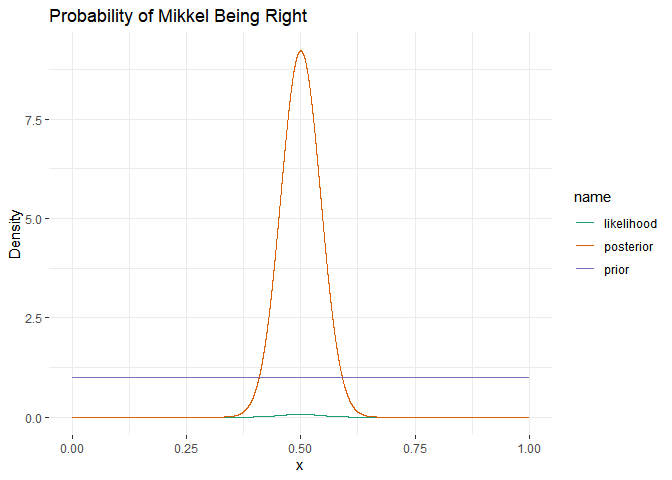
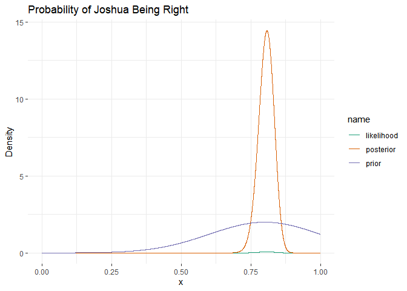
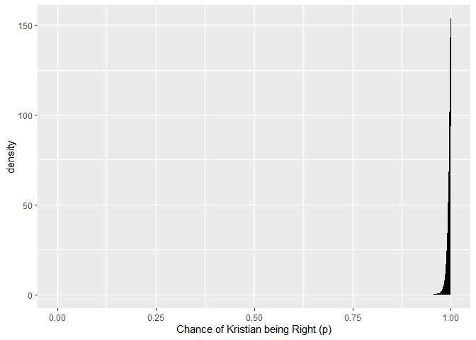
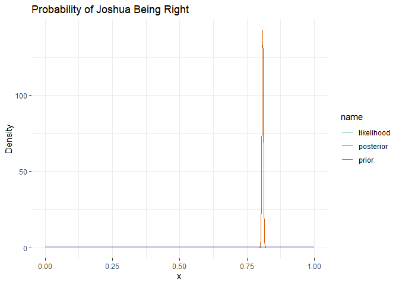
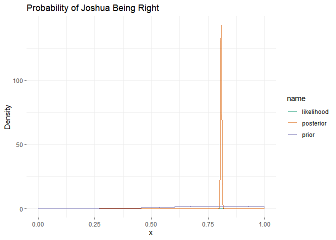

Making functions

``` r
# setup
pacman::p_load(pacman, 
               tidyverse, 
               rethinking,
               patchwork) # for ordering plots together

# We make a df for our observations
results_df <- data.frame(teacher = c("RF", "KT", "JS", "MW"),
                         correct = c(3, 2, 160, 66), 
                         n_quest = c(6, 2, 198, 132))

#We define p_grid
p_grid <-   p_grid <- seq(0,1, length.out = 10000)
#We define the bin_size
bin_size <- abs(p_grid[1] - p_grid[2])
#We define an informed prior
inf_prior <- dbeta(p_grid, 8, 4)

#We make a function
calc_teacher <- function(n_correct, n_question, prior, length_out = 10000){
  # this function calculate the posterior
  p_grid <- seq(0,1, length.out = 10000)
  likelihood <- dbinom(n_correct, 
                       size = n_question, 
                       prob = p_grid)
  unstd_posterior <- prior * likelihood
  bin_size <- abs(p_grid[1] - p_grid[2])
  posterior <- unstd_posterior/sum(unstd_posterior * bin_size)
  return(list(teacher_posterior = posterior, 
              likelihood = likelihood,
              grid = p_grid))
}


# We make a function to make a pretty plot
pretty_plot <- function(p_grid, prior, likelihood, posterior, title = " "){
  # define data
  d <- tibble(p_grid = p_grid, 
              prior = prior, 
              likelihood = likelihood,
              posterior = posterior)
  
  # make to long format
  d <- d %>% 
    pivot_longer(cols = c("prior", "likelihood", "posterior"), names_to = "name", values_to = "value")
  
  # make a 
  p <- ggplot(d, aes(x = p_grid, y = value, color = name)) + 
    geom_line() + 
    labs(x = "x", y = "Density", title = title) + 
    theme_bw() + 
    ggplot2::theme(panel.background = element_rect(fill = "white"),
                   panel.border = element_blank()) +
    scale_colour_brewer(palette = "Dark2", direction = 1)
  return(p)
}
```

In this assignment we learn how to assess rates from a binomial distribution, using the case of assessing your teachers’ knowledge of CogSci
--------------------------------------------------------------------------------------------------------------------------------------------

N.B. there is a second part at the bottom for next week.

### First part

You want to assess your teachers’ knowledge of cognitive science. “These
guys are a bunch of drama(turgist) queens, mindless philosophers,
chattering communication people and Russian spies. Do they really know
CogSci?”, you think.

To keep things simple (your teachers should not be faced with too
complicated things): - You created a pool of equally challenging
questions on CogSci - Each question can be answered correctly or not (we
don’t allow partially correct answers, to make our life simpler). -
Knowledge of CogSci can be measured on a scale from 0 (negative
knowledge, all answers wrong) through 0.5 (random chance) to 1 (awesome
CogSci superpowers)

This is the data: - Riccardo: 3 correct answers out of 6 questions -
Kristian: 2 correct answers out of 2 questions (then he gets bored) -
Josh: 160 correct answers out of 198 questions (Josh never gets bored) -
Mikkel: 66 correct answers out of 132 questions

Questions:

1.  What’s Riccardo’s estimated knowledge of CogSci? What is the
    probability he knows more than chance (0.5) \[try figuring this out.
    if you can’t peek into chapters 3.1 and 3.2 and/or the slides\]?

-   First implement a grid approximation (hint check paragraph 2.4.1!)
    with a uniform prior, calculate the posterior and plot the results
-   Then implement a quadratic approximation (hint check paragraph
    2.4.2!).
-   N.B. for the rest of the exercise just keep using the grid
    approximation (we’ll move to quadratic approximations in two
    classes)

``` r
# Creating uniform prior
prior_uniform <- 1

#Calculating posterior 
rf_uni <- calc_teacher(3, 6, prior_uniform, length_out = 1e4)

# Visualizing posterior 

pretty_plot(rf_uni$grid, prior_uniform, rf_uni$likelihood, rf_uni$teacher_posterior, title = "Probability of Riccardo Being Right")
```


``` r
set.seed(3)

# Creating a tibble from the posterior data 
rf_uni_df <- tibble(p_grid=rf_uni$grid, prior=prior_uniform, likelihood = rf_uni$likelihood, posterior = rf_uni$teacher_posterior)

# Sampling from the posterior 
samples_rf_uni <-
  rf_uni_df %>% 
  sample_n(size = 1e4, weight = posterior, replace = T)

samples_rf_uni %>% 
  ggplot(aes(x = p_grid)) +
  geom_density(fill = "black") +
  coord_cartesian(xlim = 0:1) +
  xlab("Chance of Riccardo being Right (p)")
```


``` r
#Summarizing the posterior 
rf_uni_df %>% 
  filter(p_grid >.5) %>% 
  summarise(sum = sum(posterior))/1e4
```

    ##       sum
    ## 1 0.49995

``` r
# We estimate the Highest posterior density  interval
HPDI(samples_rf_uni$p_grid, prob=0.5)
```

    ##      |0.5      0.5| 
    ## 0.3785379 0.6186619

``` r
# Getting the mean and sd
mean(samples_rf_uni$p_grid)
```

    ## [1] 0.4993688

``` r
sd(samples_rf_uni$p_grid)
```

    ## [1] 0.1660154

``` r
# This means the probability of Riccardo performing better than chance is 50 % 

# Quadratic approximation 
globe_qa <-
  rethinking::map(
    alist(
      w ~ dbinom(6, p),  # binomial likelihood
      p ~ dunif(0, 1)    # uniform prior
    ), 
    data = list(w = 3))

# display summary of quadratic approximation
precis(globe_qa)
```

    ##   Mean StdDev 5.5% 94.5%
    ## p  0.5    0.2 0.17  0.83

1.  Estimate all the teachers’ knowledge of CogSci. Who’s best? Use grid
    approximation. Comment on the posteriors of Riccardo and Mikkel. 2a.
    Produce plots of the prior, and posterior for each teacher.

``` r
#################### Kristian #########################
#Calculating posterior 
kt_uni <- calc_teacher(2, 2, prior_uniform, length_out = 1e4)

# Visualizing posterior 
pretty_plot(kt_uni$grid, prior_uniform, kt_uni$likelihood, kt_uni$teacher_posterior, title = "Probability of Kristian Being Right")
```


``` r
set.seed(3)

#Creating a tibble from the posterior etc. 
kt_uni_df <- tibble(p_grid=kt_uni$grid, prior=prior_uniform, likelihood = kt_uni$likelihood, posterior = kt_uni$teacher_posterior)

#Sampling from the posterior with sample_n to get a density plot
samples_kt_uni <-
  kt_uni_df %>% 
  sample_n(size = 1e4, weight = posterior, replace = T)

samples_kt_uni %>% 
  ggplot(aes(x = p_grid)) +
  geom_density(fill = "black") +
  coord_cartesian(xlim = 0:1) +
  xlab("Chance of Kristian being Right (p)")
```


``` r
#Summarizing the posterior 
kt_uni_df %>% 
  filter(p_grid >.5) %>% 
  summarise(sum = sum(posterior))/1e4
```

    ##         sum
    ## 1 0.8749312

``` r
# We estimate the Highest posterior density  interval
HPDI(samples_kt_uni$p_grid, prob=0.5)
```

    ##      |0.5      0.5| 
    ## 0.7923792 1.0000000

``` r
# Getting the mean and sd
mean(samples_kt_uni$p_grid)
```

    ## [1] 0.7475606

``` r
sd(samples_kt_uni$p_grid)
```

    ## [1] 0.1954394

``` r
#################################### Joshua #################################
#Calculating posterior 
js_uni <- calc_teacher(160, 198, prior_uniform, length_out = 1e4)

# Visualizing posterior 
pretty_plot(js_uni$grid, prior_uniform, js_uni$likelihood, js_uni$teacher_posterior, title = "Probability of Joshua Being Right")
```


``` r
set.seed(3)

#Creating a tibble from the posterior etc. 
js_uni_df <- tibble(p_grid=js_uni$grid, prior=prior_uniform, likelihood = js_uni$likelihood, posterior = js_uni$teacher_posterior)

#Sampling from the posterior 
samples_js_uni <-
  js_uni_df %>% 
  sample_n(size = 1e4, weight = posterior, replace = T)

samples_js_uni %>% 
  ggplot(aes(x = p_grid)) +
  geom_density(fill = "black") +
  coord_cartesian(xlim = 0:1) +
  xlab("Chance of Joshua being Right (p)")
```


``` r
#Summarizing the posterior 
js_uni_df %>% 
  filter(p_grid >.5) %>% 
  summarise(sum = sum(posterior))/1e4
```

    ##      sum
    ## 1 0.9999

``` r
# We estimate the Highest posterior density  interval
HPDI(samples_js_uni$p_grid, prob=0.5)
```

    ##      |0.5      0.5| 
    ## 0.7878788 0.8254825

``` r
# Getting the mean and sd
mean(samples_js_uni$p_grid)
```

    ## [1] 0.8047798

``` r
sd(samples_js_uni$p_grid)
```

    ## [1] 0.02818499

``` r
################################ Mikkel ####################################
#Calculating posterior 
mw_uni <- calc_teacher(66, 132, prior_uniform, length_out = 1e4)

# Visualizing posterior 
pretty_plot(mw_uni$grid, prior_uniform, mw_uni$likelihood, mw_uni$teacher_posterior, title = "Probability of Mikkel Being Right")
```



``` r
set.seed(3)

#Creating a tibble from the posterior etc. 
mw_uni_df <- tibble(p_grid=mw_uni$grid, prior=prior_uniform, likelihood = mw_uni$likelihood, posterior = mw_uni$teacher_posterior)

#Sampling from the posterior 
samples_mw_uni <-
  mw_uni_df %>% 
  sample_n(size = 1e4, weight = posterior, replace = T)

samples_mw_uni %>% 
  ggplot(aes(x = p_grid)) +
  geom_density(fill = "black") +
  coord_cartesian(xlim = 0:1) +
  xlab("Chance of Mikkel being Right (p)")
```


``` r
#Summarizing the posterior 
mw_uni_df %>% 
  filter(p_grid >.5) %>% 
  summarise(sum = sum(posterior))/1e4
```

    ##       sum
    ## 1 0.49995

``` r
# We estimate the Highest posterior density  interval
HPDI(samples_mw_uni$p_grid, prob=0.5)
```

    ##      |0.5      0.5| 
    ## 0.4719472 0.5297530

``` r
# Getting the mean and sd
mean(samples_mw_uni$p_grid)
```

    ## [1] 0.4994667

``` r
sd(samples_mw_uni$p_grid)
```

    ## [1] 0.04301949

1.  Change the prior. Given your teachers have all CogSci jobs, you
    should start with a higher appreciation of their knowledge: the
    prior is a normal distribution with a mean of 0.8 and a standard
    deviation of 0.2. Do the results change (and if so how)? 3a. Produce
    plots of the prior and posterior for each teacher.

``` r
################################### Riccardo #####################################
# Creating normally distributed prior
p_grid <- seq(from = 0, to = 1, length.out = 1e4)
prior_norm <- dnorm(p_grid, mean = 0.8, sd = 0.20)

#Calculating posterior 
rf_norm <- calc_teacher(3, 6, prior_norm, length_out = 1e4)

# Visualizing posterior 

pretty_plot(rf_norm$grid, prior_norm, rf_norm$likelihood, rf_norm$teacher_posterior, title = "Probability of Riccardo Being Right")
```


``` r
set.seed(3)

# Creating a tibble from the posterior data 
rf_norm_df <- tibble(p_grid=rf_norm$grid, prior=prior_norm, likelihood = rf_norm$likelihood, posterior = rf_norm$teacher_posterior)

# Sampling from the posterior 
samples_rf_norm <-
  rf_norm_df %>% 
  sample_n(size = 1e4, weight = posterior, replace = T)

samples_rf_norm %>% 
  ggplot(aes(x = p_grid)) +
  geom_density(fill = "black") +
  coord_cartesian(xlim = 0:1) +
  xlab("Chance of Riccardo being Right (p)")
```


``` r
#Summarizing the posterior 
rf_norm_df %>% 
  filter(p_grid >.5) %>% 
  summarise(sum = sum(posterior))/1e4
```

    ##         sum
    ## 1 0.8416926

``` r
# We estimate the Highest posterior density  interval
HPDI(samples_rf_norm$p_grid, prob=0.5)
```

    ##      |0.5      0.5| 
    ## 0.5652565 0.7397740

``` r
# Getting the mean and sd
mean(samples_rf_norm$p_grid)
```

    ## [1] 0.6253683

``` r
sd(samples_rf_norm$p_grid)
```

    ## [1] 0.126698

``` r
################################### Kristian ######################################
#Calculating posterior 
kt_norm <- calc_teacher(2, 2, prior_norm, length_out = 1e4)

# Visualizing posterior 
pretty_plot(kt_norm$grid, prior_norm, kt_norm$likelihood, kt_norm$teacher_posterior, title = "Probability of Kristian Being Right")
```


``` r
set.seed(3)

#Creating a tibble from the posterior etc. 
kt_norm_df <- tibble(p_grid=kt_norm$grid, prior=prior_norm, likelihood = kt_norm$likelihood, posterior = kt_norm$teacher_posterior)

#Sampling from the posterior 
samples_kt_norm <-
  kt_norm_df %>% 
  sample_n(size = 1e4, weight = posterior, replace = T)

samples_kt_norm %>% 
  ggplot(aes(x = p_grid)) +
  geom_density(fill = "black") +
  coord_cartesian(xlim = 0:1) +
  xlab("Chance of Kristian being Right (p)")
```


``` r
#Summarizing the posterior 
kt_norm_df %>% 
  filter(p_grid >.5) %>% 
  summarise(sum = sum(posterior))/1e4
```

    ##         sum
    ## 1 0.9756702

``` r
# We estimate the Highest posterior density  interval
HPDI(samples_kt_norm$p_grid, prob=0.5)
```

    ##      |0.5      0.5| 
    ## 0.8087809 0.9842984

``` r
# Getting the mean and sd
mean(samples_kt_norm$p_gird)
```

    ## Warning: Unknown or uninitialised column: 'p_gird'.

    ## Warning in mean.default(samples_kt_norm$p_gird): argument is not numeric or
    ## logical: returning NA

    ## [1] NA

``` r
sd(samples_kt_norm$p_grid)
```

    ## [1] 0.1333393

``` r
#################################### Joshua #################################
#Calculating posterior 
js_norm <- calc_teacher(160, 198, prior_norm, length_out = 1e4)

# Visualizing posterior 
pretty_plot(js_norm$grid, prior_norm, js_norm$likelihood, js_norm$teacher_posterior, title = "Probability of Joshua Being Right")
```



``` r
set.seed(3)

#Creating a tibble from the posterior etc. 
js_norm_df <- tibble(p_grid=js_norm$grid, prior=prior_norm, likelihood = js_norm$likelihood, posterior = js_norm$teacher_posterior)

#Sampling from the posterior 
samples_js_norm <-
  js_norm_df %>% 
  sample_n(size = 1e4, weight = posterior, replace = T)

samples_js_norm %>% 
  ggplot(aes(x = p_grid)) +
  geom_density(fill = "black") +
  coord_cartesian(xlim = 0:1) +
  xlab("Chance of Joshua being Right (p)")
```


``` r
#Summarizing the posterior 
js_norm_df %>% 
  filter(p_grid >.5) %>% 
  summarise(sum = sum(posterior))/1e4
```

    ##      sum
    ## 1 0.9999

``` r
rethinking::HPDI(samples_js_norm$p_grid, prob=0.5)
```

    ##      |0.5      0.5| 
    ## 0.7886789 0.8258826

``` r
# Getting the mean and sd
mean(samples_js_norm$p_grid)
```

    ## [1] 0.8047192

``` r
sd(samples_js_norm$p_grid)
```

    ## [1] 0.02797104

``` r
################################ Mikkel ####################################
#Calculating posterior 
mw_norm <- calc_teacher(66, 132, prior_norm, length_out = 1e4)

# Visualizing posterior 
pretty_plot(mw_norm$grid, prior_norm, mw_norm$likelihood, mw_norm$teacher_posterior, title = "Probability of Mikkel Being Right")
```


``` r
set.seed(3)

#Creating a tibble from the posterior etc. 
mw_norm_df <- tibble(p_grid=mw_norm$grid, prior=prior_norm, likelihood = mw_norm$likelihood, posterior = mw_norm$teacher_posterior)

#Sampling from the posterior 
samples_mw_norm <-
  mw_norm_df %>% 
  sample_n(size = 1e4, weight = posterior, replace = T)

samples_mw_norm %>% 
  ggplot(aes(x = p_grid)) +
  geom_density(fill = "black") +
  coord_cartesian(xlim = 0:1) +
  xlab("Chance of Mikkel being Right (p)")
```


``` r
#Summarizing the posterior 
mw_norm_df %>% 
  filter(p_grid >.5) %>% 
  summarise(sum = sum(posterior))/1e4
```

    ##         sum
    ## 1 0.6239958

``` r
# We estimate the Highest posterior density  interval
rethinking::HPDI(samples_mw_norm$p_grid, prob=0.5)
```

    ##      |0.5      0.5| 
    ## 0.4858486 0.5420542

``` r
# Getting the mean and sd
mean(samples_mw_norm$p_grid)
```

    ## [1] 0.513117

``` r
sd(samples_mw_norm$p_grid)
```

    ## [1] 0.04176717

1.  You go back to your teachers and collect more data (multiply the
    previous numbers by 100). Calculate their knowledge with both a
    uniform prior and a normal prior with a mean of 0.8 and a standard
    deviation of 0.2. Do you still see a difference between the results?
    Why?

#### Riccardo

``` r
########## Uniform Prior ################
# Creating uniform prior
prior_uniform <- 1

#Calculating posterior 
rf_uni <- calc_teacher(300, 600, prior_uniform, length_out = 1e4)

# Visualizing posterior 

pretty_plot(rf_uni$grid, prior_uniform, rf_uni$likelihood, rf_uni$teacher_posterior, title = "Probability of Riccardo Being Right")
```


``` r
set.seed(3)

# Creating a tibble from the posterior data 
rf_uni_df <- tibble(p_grid=rf_uni$grid, prior=prior_uniform, likelihood = rf_uni$likelihood, posterior = rf_uni$teacher_posterior)

# Sampling from the posterior 
samples_rf_uni <-
  rf_uni_df %>% 
  sample_n(size = 1e4, weight = posterior, replace = T)

samples_rf_uni %>% 
  ggplot(aes(x = p_grid)) +
  geom_density(fill = "black") +
  coord_cartesian(xlim = 0:1) +
  xlab("Chance of Riccardo being Right (p)")
```


``` r
#Summarizing the posterior 
rf_uni_df %>% 
  filter(p_grid >.5) %>% 
  summarise(sum = sum(posterior))/1e4
```

    ##       sum
    ## 1 0.49995

``` r
# We estimate the Highest posterior density  interval
HPDI(samples_rf_uni$p_grid, prob=0.5)
```

    ##      |0.5      0.5| 
    ## 0.4874487 0.5147515

``` r
# Getting the mean and sd
mean(samples_rf_uni$p_grid)
```

    ## [1] 0.4998123

``` r
sd(samples_rf_uni$p_grid)
```

    ## [1] 0.02020914

``` r
##################### Normally distributed prior ################################
# Creating normally distributed prior
p_grid <- seq(from = 0, to = 1, length.out = 1e4)
prior_norm <- dnorm(p_grid, mean = 0.8, sd = 0.20)

#Calculating posterior 
rf_norm <- calc_teacher(300, 600, prior_norm, length_out = 1e4)

# Visualizing posterior 

pretty_plot(rf_norm$grid, prior_norm, rf_norm$likelihood, rf_norm$teacher_posterior, title = "Probability of Riccardo Being Right")
```


``` r
set.seed(3)

# Creating a tibble from the posterior data 
rf_norm_df <- tibble(p_grid=rf_norm$grid, prior=prior_norm, likelihood = rf_norm$likelihood, posterior = rf_norm$teacher_posterior)

# Sampling from the posterior 
samples_rf_norm <-
  rf_norm_df %>% 
  sample_n(size = 1e4, weight = posterior, replace = T)

samples_rf_norm %>% 
  ggplot(aes(x = p_grid)) +
  geom_density(fill = "black") +
  coord_cartesian(xlim = 0:1) +
  xlab("Chance of Riccardo being Right (p)")
```


``` r
#Summarizing the posterior 
rf_norm_df %>% 
  filter(p_grid >.5) %>% 
  summarise(sum = sum(posterior))/1e4
```

    ##         sum
    ## 1 0.5603469

``` r
# We estimate the Highest posterior density  interval
HPDI(samples_rf_norm$p_grid, prob=0.5)
```

    ##      |0.5      0.5| 
    ## 0.4901490 0.5174517

``` r
# Getting the mean and sd
mean(samples_rf_norm$p_grid)
```

    ## [1] 0.5027396

``` r
sd(samples_rf_norm$p_grid)
```

    ## [1] 0.02020554

#### Kristian

``` r
############# Uniform ##################
#Calculating posterior 
kt_uni <- calc_teacher(200, 200, prior_uniform, length_out = 1e4)

# Visualizing posterior 
pretty_plot(kt_uni$grid, prior_uniform, kt_uni$likelihood, kt_uni$teacher_posterior, title = "Probability of Kristian Being Right")
```


``` r
set.seed(3)

#Creating a tibble from the posterior etc. 
kt_uni_df <- tibble(p_grid=kt_uni$grid, prior=prior_uniform, likelihood = kt_uni$likelihood, posterior = kt_uni$teacher_posterior)

#Sampling from the posterior 
samples_kt_uni <-
  kt_uni_df %>% 
  sample_n(size = 1e4, weight = posterior, replace = T)

samples_kt_uni %>% 
  ggplot(aes(x = p_grid)) +
  geom_density(fill = "black") +
  coord_cartesian(xlim = 0:1) +
  xlab("Chance of Kristian being Right (p)")
```


``` r
#Summarizing the posterior 
kt_uni_df %>% 
  filter(p_grid >.5) %>% 
  summarise(sum = sum(posterior))/1e4
```

    ##      sum
    ## 1 0.9999

``` r
# We estimate the Highest posterior density  interval
HPDI(samples_kt_uni$p_grid, prob=0.5)
```

    ##      |0.5      0.5| 
    ## 0.9965997 1.0000000

``` r
# Getting the mean and sd
mean(samples_kt_uni$p_grid)
```

    ## [1] 0.9950977

``` r
sd(samples_kt_uni$p_grid)
```

    ## [1] 0.004970798

``` r
################### Normally distributed prior ######################
#Calculating posterior 
kt_norm <- calc_teacher(200, 200, prior_norm, length_out = 1e4)

# Visualizing posterior 
pretty_plot(kt_norm$grid, prior_norm, kt_norm$likelihood, kt_norm$teacher_posterior, title = "Probability of Kristian Being Right")
```


``` r
set.seed(3)

#Creating a tibble from the posterior etc. 
kt_norm_df <- tibble(p_grid=kt_norm$grid, prior=prior_norm, likelihood = kt_norm$likelihood, posterior = kt_norm$teacher_posterior)

#Sampling from the posterior 
samples_kt_norm <-
  kt_norm_df %>% 
  sample_n(size = 1e4, weight = posterior, replace = T)

samples_kt_norm %>% 
  ggplot(aes(x = p_grid)) +
  geom_density(fill = "black") +
  coord_cartesian(xlim = 0:1) +
  xlab("Chance of Kristian being Right (p)")
```



``` r
#Summarizing the posterior 
kt_norm_df %>% 
  filter(p_grid >.5) %>% 
  summarise(sum = sum(posterior))/1e4
```

    ##      sum
    ## 1 0.9999

``` r
# We estimate the Highest posterior density  interval
HPDI(samples_kt_norm$p_grid, prob=0.5)
```

    ##      |0.5      0.5| 
    ## 0.9964996 1.0000000

``` r
# Getting the mean and sd
mean(samples_kt_norm$p_grid)
```

    ## [1] 0.9949695

``` r
sd(samples_kt_norm$p_grid)
```

    ## [1] 0.005115184

#### Joshua

``` r
############################ Uniform Prior #######################################
#Calculating posterior 
js_uni <- calc_teacher(16000, 19800, prior_uniform, length_out = 1e4)

# Visualizing posterior 
pretty_plot(js_uni$grid, prior_uniform, js_uni$likelihood, js_uni$teacher_posterior, title = "Probability of Joshua Being Right")
```



``` r
set.seed(3)

#Creating a tibble from the posterior etc. 
js_uni_df <- tibble(p_grid=js_uni$grid, prior=prior_uniform, likelihood = js_uni$likelihood, posterior = js_uni$teacher_posterior)

#Sampling from the posterior 
samples_js_uni <-
  js_uni_df %>% 
  sample_n(size = 1e4, weight = posterior, replace = T)

samples_js_uni %>% 
  ggplot(aes(x = p_grid)) +
  geom_density(fill = "black") +
  coord_cartesian(xlim = 0:1) +
  xlab("Chance of Joshua being Right (p)")
```


``` r
#Summarizing the posterior 
js_uni_df %>% 
  filter(p_grid >.5) %>% 
  summarise(sum = sum(posterior))/1e4
```

    ##      sum
    ## 1 0.9999

``` r
# We estimate the Highest posterior density  interval
HPDI(samples_js_uni$p_grid, prob=0.5)
```

    ##      |0.5      0.5| 
    ## 0.8059806 0.8096810

``` r
# Getting the mean and sd
mean(samples_js_uni$p_grid)
```

    ## [1] 0.8080414

``` r
sd(samples_js_uni$p_grid)
```

    ## [1] 0.002766804

``` r
############################ Normally Distributed #################################
#Calculating posterior 
js_norm <- calc_teacher(16000, 19800, prior_norm, length_out = 1e4)

# Visualizing posterior 
pretty_plot(js_norm$grid, prior_norm, js_norm$likelihood, js_norm$teacher_posterior, title = "Probability of Joshua Being Right")
```



``` r
set.seed(3)

#Creating a tibble from the posterior etc. 
js_norm_df <- tibble(p_grid=js_norm$grid, prior=prior_norm, likelihood = js_norm$likelihood, posterior = js_norm$teacher_posterior)

#Sampling from the posterior 
samples_js_norm <-
  js_norm_df %>% 
  sample_n(size = 1e4, weight = posterior, replace = T)

samples_js_norm %>% 
  ggplot(aes(x = p_grid)) +
  geom_density(fill = "black") +
  coord_cartesian(xlim = 0:1) +
  xlab("Chance of Joshua being Right (p)")
```


``` r
#Summarizing the posterior 
js_norm_df %>% 
  filter(p_grid >.5) %>% 
  summarise(sum = sum(posterior))/1e4
```

    ##      sum
    ## 1 0.9999

``` r
# We estimate the Highest posterior density  interval
HPDI(samples_js_norm$p_grid, prob=0.5)
```

    ##      |0.5      0.5| 
    ## 0.8059806 0.8096810

``` r
# Getting the mean and sd
mean(samples_js_norm$p_grid)
```

    ## [1] 0.8080394

``` r
sd(samples_js_norm$p_grid)
```

    ## [1] 0.002765654

#### Mikkel

``` r
############################### Uniform Prior ####################################
#Calculating posterior 
mw_uni <- calc_teacher(6600, 13200, prior_uniform, length_out = 1e4)

# Visualizing posterior 
pretty_plot(mw_uni$grid, prior_uniform, mw_uni$likelihood, mw_uni$teacher_posterior, title = "Probability of Mikkel Being Right")
```


``` r
set.seed(3)

#Creating a tibble from the posterior etc. 
mw_uni_df <- tibble(p_grid=mw_uni$grid, prior=prior_uniform, likelihood = mw_uni$likelihood, posterior = mw_uni$teacher_posterior)

#Sampling from the posterior 
samples_mw_uni <-
  mw_uni_df %>% 
  sample_n(size = 1e4, weight = posterior, replace = T)

samples_mw_uni %>% 
  ggplot(aes(x = p_grid)) +
  geom_density(fill = "black") +
  coord_cartesian(xlim = 0:1) +
  xlab("Chance of Mikkel being Right (p)")
```


``` r
#Summarizing the posterior 
mw_uni_df %>% 
  filter(p_grid >.5) %>% 
  summarise(sum = sum(posterior))/1e4
```

    ##       sum
    ## 1 0.49995

``` r
# We estimate the Highest posterior density  interval
HPDI(samples_mw_uni$p_grid, prob=0.5)
```

    ##      |0.5      0.5| 
    ## 0.4966497 0.5024502

``` r
# Getting the mean and sd
mean(samples_mw_uni$p_grid)
```

    ## [1] 0.4999577

``` r
sd(samples_mw_uni$p_grid)
```

    ## [1] 0.004328824

``` r
############################### Normally Distributed ############################
#Calculating posterior 
mw_norm <- calc_teacher(6600, 13200, prior_norm, length_out = 1e4)

# Visualizing posterior 
pretty_plot(mw_norm$grid, prior_norm, mw_norm$likelihood, mw_norm$teacher_posterior, title = "Probability of Mikkel Being Right")
```


``` r
set.seed(3)

#Creating a tibble from the posterior etc. 
mw_norm_df <- tibble(p_grid=mw_norm$grid, prior=prior_norm, likelihood = mw_norm$likelihood, posterior = mw_norm$teacher_posterior)

#Sampling from the posterior 
samples_mw_norm <-
  mw_norm_df %>% 
  sample_n(size = 1e4, weight = posterior, replace = T)

samples_mw_norm %>% 
  ggplot(aes(x = p_grid)) +
  geom_density(fill = "black") +
  coord_cartesian(xlim = 0:1) +
  xlab("Chance of Mikkel being Right (p)")
```


``` r
#Summarizing the posterior 
mw_norm_df %>% 
  filter(p_grid >.5) %>% 
  summarise(sum = sum(posterior))/1e4
```

    ##         sum
    ## 1 0.5129637

``` r
# We estimate the Highest posterior density  interval
HPDI(samples_mw_norm$p_grid, prob=0.5)
```

    ##      |0.5      0.5| 
    ## 0.4967497 0.5025503

``` r
# Getting the mean and sd
mean(samples_mw_norm$p_grid)
```

    ## [1] 0.5001025

``` r
sd(samples_mw_norm$p_grid)
```

    ## [1] 0.004333477

1.  Imagine you’re a skeptic and think your teachers do not know
    anything about CogSci, given the content of their classes. How would
    you operationalize that belief?

2.  Optional question: Can you estimate the difference between
    Riccardo’s estimated knowledge and that of each of the other
    teachers? Would you deem it credible (that is, would you believe
    that it is actually different)?

### Second part: Focusing on predictions

Last year you assessed the teachers (darned time runs quick!). Now you
want to re-test them and assess whether your models are producing
reliable predictions. In Methods 3 we learned how to do machine-learning
style assessment of predictions (e.g. rmse on testing datasets).
Bayesian stats makes things a bit more complicated. So we’ll try out how
that works. N.B. You can choose which prior to use for the analysis of
last year’s data.

Questions to be answered (but see guidance below): 1- Write a paragraph
discussing how assessment of prediction performance is different in
Bayesian vs. frequentist models 2- Provide at least one plot and one
written line discussing prediction errors for each of the teachers.

This is the old data: - Riccardo: 3 correct answers out of 6 questions -
Kristian: 2 correct answers out of 2 questions (then he gets bored) -
Josh: 160 correct answers out of 198 questions (Josh never gets bored) -
Mikkel: 66 correct answers out of 132 questions

This is the new data: - Riccardo: 9 correct answers out of 10 questions
(then he freaks out about teaching preparation and leaves) - Kristian: 8
correct answers out of 12 questions - Josh: 148 correct answers out of
172 questions (again, Josh never gets bored) - Mikkel: 34 correct
answers out of 65 questions

Guidance Tips

1.  There are at least two ways of assessing predictions.
2.  Last year’s results are this year’s expectations.
3.  Are the parameter estimates changing? (way 1)
4.  How does the new data look in last year’s predictive posterior?
    (way 2)

``` r
#creating a dataframe of the results
results_df = data.frame(teacher = c("RF", "KT", "JS", "MW"), 
                        correct = c(3, 2, 160, 66) , 
                        n_quest = c(6, 2, 198, 132))

results_df_2 <- data.frame(teacher = c("RF", "KT", "JS", "MW"),
                           correct = c(9, 8, 148, 34),
                           n_quest = c(10, 12, 172, 65))

#Grid approximation 
length = 1e4 #10.000
p_grid <- seq(0, 1, length.out = length)
inf_prior <- dnorm(p_grid, mean = 0.8, sd = 0.20)

rf_results <- calc_teacher(2, 2, prior = inf_prior)

### Kristian ###
#Old posterior 
kt_results <- calc_teacher(2, 2, prior = inf_prior)

#New posterior
kt_results_2 <- calc_teacher(8, 12, prior = kt_results$teacher_posterior)

pretty_plot(p_grid = kt_results_2$grid, 
            prior = kt_results$teacher_posterior, 
            likelihood = kt_results_2$likelihood, 
            posterior = kt_results_2$teacher_posterior, title = "New Posterior Distribution Kristian")
```


``` r
js_results <- calc_teacher(2, 2, prior = inf_prior)


mw_results <- calc_teacher(2, 2, prior = inf_prior)
```

Part 2 2- Provide at least one plot and one written line discussing
prediction errors for each of the teachers.

``` r
# We make a new df for this years observations
results_df_2 <- data.frame(teacher = c("RF", "KT", "JS", "MW"),
                         correct = c(9, 8, 148, 34), 
                         n_quest = c(10, 12, 172, 65))
#We define p_grid
p_grid <-   p_grid <- seq(0,1, length.out = 10000)
#We define the bin_size
bin_size <- abs(p_grid[1] - p_grid[2])
#We define an informed prior
inf_prior <- dnorm(p_grid, 0.8, 0.2)

# We use the function to calculate the old kt results
kt_results <- calc_teacher(2, 2, prior = inf_prior)
# We plot it
plot(kt_results$grid, kt_results$teacher_posterior)
```


``` r
#Now we want to calculate the new results with the old results as a prior
# We use the function to calculate the old kt results
kt_results_2 <- calc_teacher(8, 12, prior = kt_results$teacher_posterior)
# We plot it
plot(kt_results_2$grid, kt_results_2$teacher_posterior)
```


``` r
# We plot the new
pretty_plot(p_grid, 
            prior = kt_results$teacher_posterior, 
            likelihood = kt_results_2$likelihood, 
            posterior = kt_results_2$teacher_posterior, title = "Kristian's new posterior distribution")
```


``` r
# We now make a tibble to calculate mean and sd
kt_df <- tibble(p_grid=p_grid, prior=kt_results$teacher_posterior, likelihood = kt_results_2$likelihood, posterior = kt_results_2$teacher_posterior)

# We sample for the posterior
samples_kt <-
  kt_df %>% 
  sample_n(size = 1e4, weight = posterior, replace = T)

# we calculate mean and sd
mean(samples_kt$p_grid)
```

    ## [1] 0.7173801

``` r
sd(samples_kt$p_grid)
```

    ## [1] 0.09464107

``` r
# We sample from the prior
samples_kt <-
  kt_df %>% 
  sample_n(size = 1e4, weight = prior, replace = T)

# We calculate mean and sd
mean(samples_kt$p_grid)
```

    ## [1] 0.8035473

``` r
sd(samples_kt$p_grid)
```

    ## [1] 0.1332873

``` r
###Mikkel###

mw_old<-calc_teacher(66,132,inf_prior,length_out = 10000)
#calculate new results
mw_new<-calc_teacher(34,65,mw_old$teacher_posterior,length_out = 10000)

#function(p_grid, prior, likelihood, posterior, title = " ")
mw_old_plot<-pretty_plot(p_grid,inf_prior,mw_old$likelihood,mw_old$teacher_posterior)
mw_old_plot
```


``` r
mw_new_plot<-pretty_plot(
  p_grid=mw_results$grid, mw_old$teacher_posterior,
  mw_new$likelihood,
  mw_new$teacher_posterior,
  title ="Mikkel´s new posterior distribution")
mw_new_plot
```


``` r
# We now make a tibble to calculate mean and sd
mw_df <- tibble(p_grid=p_grid, prior=mw_old$teacher_posterior, likelihood = mw_new$likelihood, posterior = mw_new$teacher_posterior)

# We sample for the posterior
samples_mw <-
  mw_df %>% 
  sample_n(size = 1e4, weight = posterior, replace = T)

# we calculate mean and sd
mean(samples_mw$p_grid)
```

    ## [1] 0.5174327

``` r
sd(samples_mw$p_grid)
```

    ## [1] 0.03483223

``` r
# We sample from the prior
samples_mw <-
  mw_df %>% 
  sample_n(size = 1e4, weight = prior, replace = T)

# We calculate mean and sd
mean(samples_mw$p_grid)
```

    ## [1] 0.5141518

``` r
sd(samples_mw$p_grid)
```

    ## [1] 0.04184823

``` r
###Josh###

j_old<-calc_teacher(160,198,inf_prior,length_out = 10000)
#calculate new results
j_new<-calc_teacher(148,172,j_old$teacher_posterior,length_out = 10000)

#function(p_grid, prior, likelihood, posterior, title = " ")
j_old_plot<-pretty_plot(p_grid,inf_prior,j_old$likelihood,j_old$teacher_posterior)
j_old_plot
```


``` r
j_new_plot<-pretty_plot(p_grid,j_old$teacher_posterior,j_new$likelihood,j_new$teacher_posterior,"Josh´s new posterior distribution")
j_new_plot
```


``` r
# We now make a tibble to calculate mean and sd
js_df <- tibble(p_grid=p_grid, prior=j_old$teacher_posterior, likelihood = j_new$likelihood, posterior = j_new$teacher_posterior)

# We sample for the posterior
samples_js <-
  js_df %>% 
  sample_n(size = 1e4, weight = posterior, replace = T)

# we calculate mean and sd
mean(samples_js$p_grid)
```

    ## [1] 0.8306575

``` r
sd(samples_js$p_grid)
```

    ## [1] 0.01923289

``` r
# We sample from the prior
samples_js <-
  js_df %>% 
  sample_n(size = 1e4, weight = prior, replace = T)

# We calculate mean and sd
mean(samples_js$p_grid)
```

    ## [1] 0.8049001

``` r
sd(samples_js$p_grid)
```

    ## [1] 0.0274927

``` r
###riccardo###

r_old<-calc_teacher(3,6,inf_prior,length_out = 10000)
#calculate new results
r_new<-calc_teacher(9,10,r_old$teacher_posterior,length_out = 10000)

#function(p_grid, prior, likelihood, posterior, title = " ")
r_old_plot<-pretty_plot(p_grid,inf_prior,r_old$likelihood,r_old$teacher_posterior, title = "Riccardos old posterior distribution")
r_old_plot
```


``` r
r_new_plot<-pretty_plot(p_grid,r_old$teacher_posterior,r_new$likelihood,r_new$teacher_posterior,"Riccardo´s new posterior distribution")
r_new_plot
```


``` r
# We now make a tibble to calculate mean and sd
rf_df <- tibble(p_grid=p_grid, prior=r_old$teacher_posterior, likelihood = r_new$likelihood, posterior = r_new$teacher_posterior)
# We sample for the posterior
samples_rf <-
  rf_df %>% 
  sample_n(size = 1e4, weight = posterior, replace = T)
# we calculate mean and sd
mean(samples_rf$p_grid)
```

    ## [1] 0.7410856

``` r
sd(samples_rf$p_grid)
```

    ## [1] 0.08838825

``` r
# We sample from the prior
samples_rf <-
  rf_df %>% 
  sample_n(size = 1e4, weight = prior, replace = T)
# We calculate mean and sd
mean(samples_rf$p_grid)
```

    ## [1] 0.6280878

``` r
sd(samples_rf$p_grid)
```

    ## [1] 0.1255649
